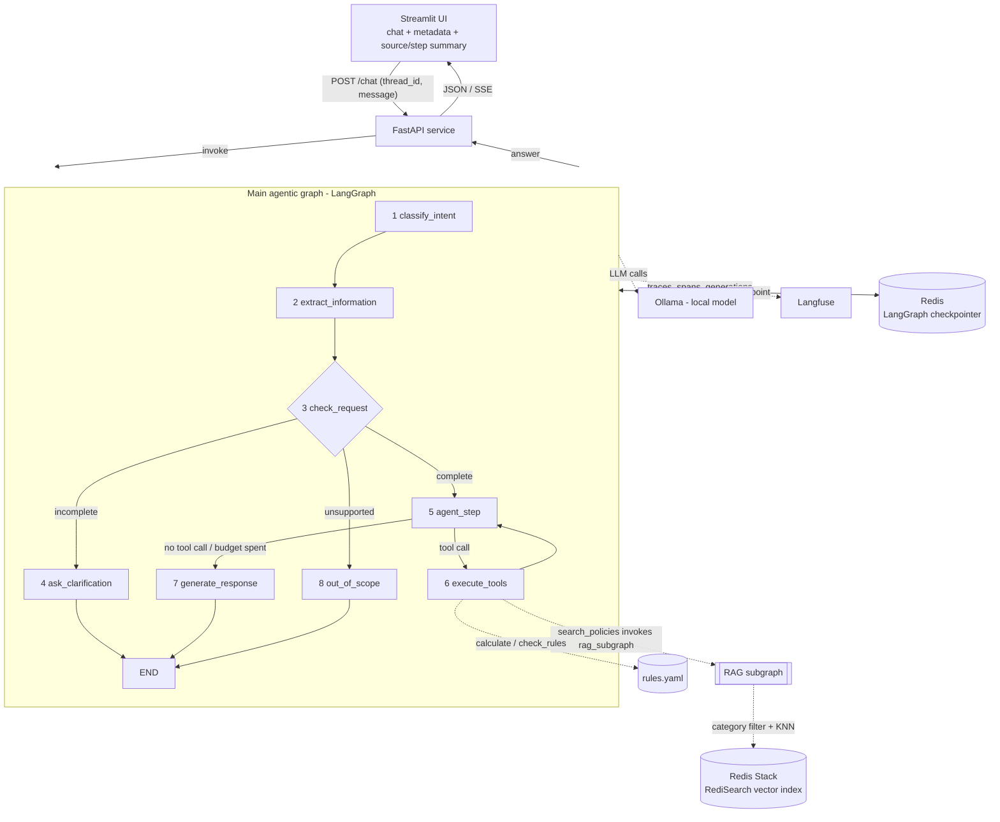
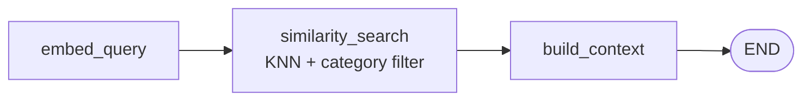

# Technical Design – Agentic RAG Expense & Benefits Assistant

Detailed technical plan for the idea described in [01-idea-plan.en.md](01-idea-plan.en.md).
This document defines what gets built, how the pieces fit together, and what each component's
contract is. It is the implementation reference.

---

## 1. Requirement traceability

| Assignment requirement | Where it is satisfied |
| --- | --- |
| Real problem + justification | [01-idea-plan.en.md](01-idea-plan.en.md), README §1 |
| LangGraph agentic workflow, ≥5 nodes | §6 – focused main graph with 8 nodes |
| Autonomous decision making (conditional routing) | §6.3 – ReAct tool-calling loop: the LLM picks the tools and their arguments; §6.4 – `route_after_agent` |
| Decomposition into subtasks | §6 – separate classification, extraction, request checking, tool execution and response generation |
| State management for intermediate results | §5 – `AgentState`, checkpointed per thread |
| ≥2 tools, at least one non-retrieval | §7 – calculator, rule checker, deadline checker |
| Dedicated modular RAG subgraph (not counted in the node budget) | §8 – compiled `rag_graph` (similarity search + category tag filter), invoked by the `search_policies` tool |
| Free-form text data source, quality over quantity | §4 – fictional `.docx` policy corpus (EN + HU) under `.docs/sources/`, header-aware chunking, per-language Redis vector index |
| No paid API, local open-source LLM + trade-off notes | §9 – Ollama + Qwen2.5-7B-Instruct, dummy LLM fallback |
| Streamlit UI showing the main steps and RAG result | §10.2 – streamed, expandable source and step summary; §11 – detailed diagnostics in Langfuse |
| Containerised, Dockerfile mandatory, compose preferred | §12 – root `Dockerfile` + compose with `api`, `ui`, `ollama`, `redis` |
| 10–20 question functional eval | §13 – version-controlled `eval/dataset.<lang>.json`, executed as a Langfuse experiment |
| 50–200 query load test, latency, bottleneck, 1–2 optimisations | §14 |
| README with problem, architecture, results, run instructions | §16 – milestone M7 |

---

## 1.1 Note on scope and complexity

This design is intentionally limited to the smallest workflow that still demonstrates the assignment:
separate intent classification and extraction, deterministic clarification routing, an autonomous
tool loop, modular RAG and grounded response generation. Technical work that does not strengthen one
of those behaviours stays out of the graph.

## 1.2 Hard constraint: it has to run on one developer machine

The single most shaping constraint of this design is not a requirement in the brief, it is the hardware:
**everything must run on my own machine** — one CPU box (WSL2), no GPU cluster, no paid API, alongside the
editor and the browser, and it must still answer in a time a demo can survive. Most of the technology choices
below are downstream of that, and they are only defensible with it in mind:

| Choice | Because of the constraint |
| --- | --- |
| 7B model at Q4 (§9) | ~5 GB resident; a 14B or 70B would not fit next to everything else, and CPU generation would leave the demo unusable |
| 384-dim small multilingual embedder (§4.3) | ~470 MB and a fast CPU forward pass, so query embedding never competes with the LLM for the machine |
| Corpus of 8 short documents per language (§4.1) | a few hundred chunks, which is also why a dense-only, filter-first retrieval path is enough |
| Redis Stack as the only datastore (§4.3) | one service instead of three, and an in-memory index this size costs megabytes |
| One `uvicorn` worker, load test at concurrency 2–4 (§14) | Ollama serialises generation on one machine; higher concurrency measures queueing, not capacity |
| `DummyLLM` backend (§9) | the graph, the API and the tests must be runnable — and CI-able — without the model loaded at all |
| Simple RAG, no reranker (§8) | a cross-encoder pass would cost more CPU than it can earn back on this corpus |

Stated plainly because it changes how the numbers in §14 should be read: the bottleneck analysis describes a
laptop-class deployment, not a tuned server. A GPU host would move the bottleneck and would justify different
choices in almost every row above — bigger model, bigger embedder, a reranker.

---

## 2. Architecture overview



**The agent runs in a FastAPI service; Streamlit is only a client.** The UI imports no graph code —
it talks HTTP. That keeps the agent independently callable (curl, the eval harness, another
front-end), makes the load test a real HTTP scenario instead of an in-process loop, and matches the
brief's preference for a multi-component compose setup.

Two-layer knowledge design, and the single most important design decision in the project:

- **Prose policies** (`.docs/sources/<lang>/*.docx`) are the RAG corpus – they answer "what does the rule
  say", and provide citations.
- **Machine-readable rule catalogue** (`rules.yaml`) drives the deterministic tools –
  limits, rates, thresholds, deadlines. The LLM never invents a number; it selects a rule id and
  the tool computes.

Both describe the same fictional policy set and are kept in sync by a consistency test (§13.4), so a
citation always backs the number that was calculated. **In this PoC `rules.yaml` is hand-authored** —
see §4.5 for why, and for what a non-PoC version would do instead (derive it from the documents).

---

## 3. Repository layout

```
app/
  main.py                     # FastAPI app assembly and lifespan
  dependencies.py             # providers for AgentService and shared runtime resources
  api/
    router.py                 # combines the route modules
    schemas.py                # public and evaluation HTTP contracts
    routes/
      chat.py                 # chat, streaming and thread reset endpoints
      health.py               # liveness and readiness endpoints
      admin.py                # evaluation, ingest and index-stat endpoints
  agent/
    service.py                # invoke, stream and reset use cases exposed to the API
    graph.py                  # 8 nodes, routing and graph construction
    nodes.py                  # node implementations, including classify_intent
    state.py                  # AgentState and domain models
    tools.py                  # typed tool registry and deterministic implementations
    prompts.py                # prompt names, embedded PoC fallbacks and resolver
  core/
    config.py                 # deployment-dependent settings
    logging.py                # stdout and rotating-file application logging
    observability.py          # correlation fields and Langfuse tracing setup
  integrations/
    llm.py                    # provider adapter and structured-output calls
    redis.py                  # shared Redis connection and LangGraph checkpointer
  rag/
    graph.py                  # dedicated embed -> search -> context subgraph
    ingest.py                 # DOCX loading, chunking and ingest CLI
    store.py                  # Redis vector index operations
  ui.py                       # Streamlit chat and HTTP client
eval/
  dataset.en.json             # 20 functional test cases per language; source of truth
  dataset.hu.json
  load_queries.en.json        # version-controlled query bank for the load scenario
  load_queries.hu.json
  run_eval.py                 # sync dataset + run Langfuse experiment + local reports
  load_test.py                # 50-200 traced queries over HTTP + local reports
tests/
  test_graph.py  test_rag.py  test_tools.py  test_api.py
rules.yaml                    # small language-independent deterministic rule catalogue
.docs/                        # plan, source corpus and generated evaluation reports
pyproject.toml                # Ruff, Bandit and pytest configuration
sonar-project.properties      # Sonar source, test and coverage paths
Dockerfile
docker-compose.yml
entrypoint.sh
requirements.in              # direct runtime dependencies
requirements.txt             # pinned runtime lock file
requirements-dev.in          # direct test and quality-tool dependencies
requirements-dev.txt         # pinned development lock file
README.md
```

All endpoint functions live under `app/api/routes/`. `app/api/router.py` only combines their
`APIRouter` instances, and `app/main.py` only assembles the FastAPI application and owns its
lifespan. `app/dependencies.py` exposes the application-level dependency providers used by the
routes, including access to the lifespan-created `AgentService`, Redis connection and active
configuration. It performs no resource creation at import time. This keeps transport code out of
both the application entry point and the agent workflow.

---

## 4. Data layer

### 4.1 Corpus

The policy documents describe a fictional company, are used only for this prototype, and have no
legal or tax validity. The source-pack README files and the UI disclaimer make that boundary clear.

**Two parallel corpora, two indices, one active at a time.** The knowledge base exists in English
(`.docs/sources/en/`) and Hungarian (`.docs/sources/hu/`); ingest builds a **separate Redis index per language**
(`idx:chunks:en`, `idx:chunks:hu`), and `ACTIVE_LANG` in the config decides which one the assistant
queries. Switching language is an env-var change plus a restart — no re-ingest, because both indices
are already built and stored.

Why separate indices rather than one index with a `lang` filter: each language can then have its own
embedding model and therefore its own vector dimension (§4.3), the manifests and rebuilds are
independent, and a query can never accidentally mix languages in one context block. The cost is one
extra `FT.CREATE` and roughly double the index memory — irrelevant at this corpus size.

Translating everything to English and keeping a single corpus would have been simpler. It was rejected on
realism grounds: **real internal company documents are not English-only.** A Hungarian company's expense
policy is written in Hungarian, often with English terms mixed in, and its employees ask in Hungarian — so an
English-only prototype would solve an easier retrieval problem than the real one. Carrying both corpora keeps
the design honest about that, and makes the language question a measurement (§13.2) instead of an assumption.

The two corpora are **mirrors, not independent documents**: same `doc_id`s, categories and rule ids,
with translated prose. `rules.yaml`, the rule ids and all enum values stay
English and language-independent, so the deterministic tools never see a translated value regardless of
`ACTIVE_LANG`. A test asserts the mirror property (§13.4) — a document that exists in only one language
is a bug, not a feature.

The existing source pack contains eight **`.docx`** files per language:

| File | Content |
| --- | --- |
| `00_Document_Index_and_Glossary.docx` | document index and domain glossary |
| `01_General_Expense_Reimbursement_Policy.docx` | general eligibility and reimbursement rules |
| `02_Business_Travel_and_Accommodation_Policy.docx` | business travel, accommodation and related expenses |
| `03_Commuting_Support_Policy.docx` | commuting support and public transport |
| `04_Personal_Vehicle_for_Business_Use.docx` | mileage, private vehicle use, parking and tolls |
| `05_Employee_and_Recreational_Benefits.docx` | employee, recreation and training benefits |
| `06_Receipt_and_Approval_Requirements.docx` | receipts, approvals and submission requirements |
| `07_FAQ_and_Example_Cases.docx` | short questions and worked examples |

The Hungarian files under `.docs/sources/hu/` use translated names with the same `00`–`07` prefixes.
That prefix is the stable language-independent `doc_id`.

The source folders remain unchanged. Small language-independent retrieval metadata lives beside the
deterministic rules in root `rules.yaml`, keyed by `doc_id`:

```yaml
documents:
  "01":
    categories: [general, meal, equipment]
    sections:
      business-meal-limit:
        headings:
          en: ["4. Business meals"]
          hu: ["4. Üzleti étkezés"]
```

The section key is a stable, language-independent anchor used by `doc_ref`
(`01#business-meal-limit`). During normalisation, the language-specific heading path resolves to
that anchor; ingest then attaches the ids of rules whose `doc_ref` points to it. Ingest fails on an
unknown document prefix, empty category list, unresolved heading path or rule reference. This avoids
deriving stable ids from translated heading text.

### 4.2 Loading and chunking

**`.docx` → Markdown normalisation comes first.** A header-aware Markdown splitter is the right tool
for this corpus, but only if the heading structure survives the load. A plain text extraction
(`docx2txt`, `UnstructuredWordDocumentLoader` in text mode) flattens Word headings into ordinary
paragraphs — after that a `MarkdownHeaderTextSplitter` has nothing to split on and silently degrades to
fixed-size chunks, which destroys the "one chunk = one rule section" property the citations and the
`rule_ids` metadata depend on.

So `app/rag/ingest.py` converts explicitly with `python-docx`:

| Word element | Markdown output |
| --- | --- |
| paragraph style `Heading 1..3` | `#` / `##` / `###` + text |
| `Title` | document `#` heading (falls back to the file name) |
| normal paragraph | plain paragraph |
| list paragraphs (`List Bullet`, `List Number`) | `-` / `1.` items |
| table | GitHub-style Markdown table, emitted as one block |
| everything else (images, headers/footers, comments, tracked changes) | dropped |

`markitdown` or `mammoth` (docx → HTML → Markdown) are the alternatives; `python-docx` is chosen
because the mapping above is ~60 lines, has no extra service dependency, and gives exact control over
tables, which contain policy limits and examples used by the tools.

Then the split, on Markdown, whatever the source format was:

- `MarkdownHeaderTextSplitter` on `#`/`##`/`###`, so a chunk boundary is a rule boundary and the
  heading path becomes the `section` metadata.
- `RecursiveCharacterTextSplitter` (`chunk_size=800`, `chunk_overlap=120` characters) as a size guard
  for over-long sections only.
- **Tables are never split**: a table block is kept whole even if it exceeds `chunk_size`; half a rate
  table is worse than a long chunk.
- Sections shorter than ~200 characters (typical in document `07`) are merged with the following sibling, so
  a chunk is never a bare heading.

One chunk ideally equals one rule section, which makes citations precise and keeps top-4 similarity
search sufficient without a reranking step.

The normalised Markdown stays in memory during ingest. Conversion behaviour is covered by tests;
the repository keeps only the original DOCX source files.

Chunk metadata (also the citation payload):

```python
{
  "doc_id": "03",
  "doc_title": "Commuting allowance policy",
  "section_id": "distance-based-bands",
  "section": "Distance-based bands",
  "rule_ids": ["R-COMM-02"],
  "categories": ["commuting"],
  "chunk_index": 7,
  "source_path": ".docs/sources/en/03_Commuting_Support_Policy.docx",
  "lang": "en"
}
```

`lang` is derived from the folder name, the title from the document, and `categories`, the stable
section anchor and `rule_ids` from the validated `rules.yaml` mapping above.

**Category tag filtering is the retrieval-precision mechanism of this design** (see §8). The active
category and `general` are a Redis TAG pre-filter inside the KNN query:

```
(@categories:{commuting|general})=>[KNN 4 @embedding $vec AS score]
```

Consequently every chunk must carry an accurate `categories` list. Ingest validates the document
metadata in `rules.yaml` before embedding anything, and a test asserts that every category has at
least one indexed chunk.

### 4.3 Indexing

- Embeddings: **one multilingual model serves both indices** —
  `intfloat/multilingual-e5-small` (384 dims, ~470 MB, 100+ languages including Hungarian; `query:` /
  `passage:` prefixes handled in `store.py`). The model id and revision are pinned constants — see
  below for why multilingual is the right default here.
- Store: **Redis Stack** (`redis/redis-stack-server`), the single datastore of the project — the vector
  index and LangGraph checkpoints live in it, addressed by key namespace. Accessed via
  `redis-py` (`redis.asyncio`) through one connection pool in `app/integrations/redis.py`.
- Retrieval is dense-only: RediSearch KNN with a tag pre-filter. No lexical/BM25 index and no
  fusion — on a corpus of this size and with a category filter already narrowing the candidate set,
  a second index would add moving parts without a measurable precision gain. `text` and `rule_ids`
  are indexed as TEXT/TAG fields anyway, so an exact-term lookup (e.g. "which section is R-MEAL-01")
  is available as a plain RediSearch query without building a parallel retrieval path.

#### Why a multilingual embedding model

- **Both languages in one vector space.** The same model embeds both corpora, so a chunk means the same
  thing on the `en` and the `hu` side. That is what makes the per-language eval numbers (§13.2) comparable:
  a hit-rate difference is attributable to the corpus and the questions, not to two different embedders.
- **Trained for exactly this asymmetry.** The e5 family is retrieval-trained with a `query:` / `passage:`
  distinction — a short question against a long policy section — rather than for sentence similarity. It is
  the shape of every request this system makes.
- **Code-switching is normal in this domain.** Hungarian corporate prose is full of English terms
  (*home office*, *per diem*, *cafeteria*, *business review*), and questions mix them freely. A multilingual
  model handles a mixed sentence natively; a monolingual one treats half of it as noise.
- **Small enough to be invisible in the latency budget.** 384 dimensions, ~470 MB: one download baked into
  the image, one warm-up in the API lifespan, one dimension to reason about, and a query embedding that
  costs a fraction of a single LLM call (§14). The RAM that matters goes to the 7B model.
- **Language becomes a data property, not a code property.** Adding a third corpus means a folder and an
  ingest run — no second model, no second dimension, no branching in `store.py`.

If retrieval hit rate disappoints at M7, the upgrade path is a bigger multilingual model rather than a
different architecture:

| Model | Dims | Size | When it makes sense |
| --- | --- | --- | --- |
| `intfloat/multilingual-e5-small` (default) | 384 | ~470 MB | CPU-only prototype, this corpus size |
| `intfloat/multilingual-e5-base` | 768 | ~1.1 GB | first upgrade — same family, same prefixes, just stronger |
| `Qwen3-Embedding-0.6B` | 1024 (Matryoshka-truncatable) | ~1.2 GB (fp16) | best multilingual quality of the three; instruction-aware queries, and the dimension can be truncated to 512/256 to keep the index small. Costs ~5× the forward pass of e5-small on CPU and competes with the LLM for RAM — worth it if the eval shows retrieval, not generation, is the weak link |
| `BAAI/bge-m3` | 1024 | ~2.2 GB | strong multilingual retrieval, but the heaviest option and no advantage this corpus can show |

Switching requires changing the pinned model constant and re-ingesting: each index stores its model,
revision and `DIM` in `manifest:corpus:{lang}`, so a changed model rebuilds that index instead of
silently mixing vector generations.

Index and keys — one index per language, each scoped to its own key prefix:

```
key:    chunk:{lang}:{doc_id}:{chunk_index}    # HASH
fields: text, embedding (FLOAT32 blob), doc_id, doc_title, section,
        section_id, categories (tag, "|"-separated), rule_ids (tag), chunk_index, source_path, lang

FT.CREATE idx:chunks:en ON HASH PREFIX 1 chunk:en: SCHEMA
  text        TEXT
  doc_id      TAG
  section_id  TAG
  categories  TAG SEPARATOR "|"
  rule_ids    TAG SEPARATOR "|"
  section     TEXT NOSTEM
  embedding   VECTOR HNSW 6 TYPE FLOAT32 DIM <dim of EMBEDDING_MODEL> DISTANCE_METRIC COSINE

FT.CREATE idx:chunks:hu ON HASH PREFIX 1 chunk:hu: SCHEMA   # identical schema and DIM
```

Because the index is language-scoped, the KNN query needs no `lang` filter — `store.py` resolves
`idx:chunks:{ACTIVE_LANG}` and everything downstream is language-agnostic. The `lang` field stays on
the hash for provenance and debugging.

| Key namespace | Purpose | TTL |
| --- | --- | --- |
| `chunk:{lang}:*` + `idx:chunks:{lang}` | corpus chunks and the vector index, per language | none |
| `manifest:corpus:{lang}` | per-language hash of corpus + chunking params + embedding model | none |
| `checkpoint:*` | LangGraph conversation state (§5) | 24 h |

- Ingest (`python -m app.rag.ingest [--lang en]`) reads `en/` and `hu/` under `.docs/sources/`
  and builds each language independently: convert → chunk → embed → upsert in a pipeline
  (batch 128). Idempotent per language: `manifest:corpus:{lang}` holds the hash of that corpus + chunking
  params + embedding model; on mismatch it drops only that index (`FT.DROPINDEX idx:chunks:{lang} DD`)
  and rebuilds it. The app never embeds the corpus at request time.
- `DIM` is derived from that language's embedding model at ingest time and stored in its manifest, so
  switching models cannot leave a dimension-mismatched index behind.
- A language may be missing (nothing ingested yet) without breaking the other; the API's `/ready`
  fails only if `ACTIVE_LANG`'s index is absent or dimension-mismatched.
- Durability: AOF (`appendonly yes`) on a named volume. Losing Redis costs the index (rebuildable in
  one ingest run, ~seconds for this corpus) and open conversations — acceptable for a prototype, and
  the app rebuilds on boot.

### 4.4 `rules.yaml` shape

```yaml
version: 1
currency: HUF
fx_rates_fixed: { EUR: 400, USD: 370 }        # fictional, no external FX API
documents:
  "00": { categories: [general] }
  "01": { categories: [general, meal, equipment] }
  "02": { categories: [travel] }
  "03": { categories: [commuting] }
  "04": { categories: [mileage] }
  "05": { categories: [benefits] }
  "06": { categories: [general] }
  "07": { categories: [general] }
submission:
  deadline_days: 30
  approval_threshold_huf: 100000
categories:
  meal:
    rules:
      - id: R-MEAL-01
        limit_per_person_huf: 15000
        doc_ref: 01#business-meal-limit
      - id: R-MEAL-03
        excluded_items: [alcohol, minibar]
    required_documents: [invoice, business_purpose_note, participant_list]
  commuting:
    rules:
      - id: R-COMM-01
        min_one_way_km: 5
      - id: R-COMM-02
        rate_huf_per_km: 30
        monthly_cap_huf: 60000
        hybrid_prorata: true
      - id: R-COMM-03
        pass_reimbursement_ratio: 0.86
    required_documents: [address_declaration, monthly_commute_log]
  mileage: { ... }
  equipment: { ... }
  benefits:
    rules:
      - id: R-BEN-01
        annual_budget_huf: 300000
        carry_over: false
        eligible_after_months: 6
```

`app/agent/tools.py` loads it once, validates it with pydantic, and exposes typed accessors
(`rules.meal.limit_per_person`). A missing or malformed rule raises at startup, not mid-request.

### 4.5 `rules.yaml` is hand-authored — and would not be in a real system

Root `rules.yaml` is written by hand for the PoC. Worth stating plainly, because it is
the one place where the prototype is better prepared than a real system would be.

Why: with the numbers fixed, a wrong calculation has one possible cause — the tool. If the limits came from an
LLM extraction step, the eval's calculation metric could not tell bad extraction from a bad tool.

What a non-PoC version would do instead: **extract the catalogue from the documents.** An offline LLM pass
per section proposes rules into the same pydantic schema, each with the `doc_ref` it came from. A rule is only
accepted if its number appears verbatim in the cited section — the consistency test of §13.4 used as a gate —
and the resulting diff is reviewed by a human before the catalogue is versioned. At runtime nothing changes:
the tools still read a validated catalogue, never raw LLM output.

It is out of scope here because an extraction pipeline plus a review workflow is a project of its own, and
none of it improves the agentic behaviour this assignment is graded on.

---

## 5. State

Rule for what goes in: **state holds only what a later node reads and cannot cheaply recompute.**
Anything derivable is a function, anything only humans read is a trace event. A checkpointed state is
also a serialisation contract — every extra key is another thing to migrate and another way for two
nodes to disagree about the same fact.

```python
class AgentState(TypedDict, total=False):
    messages: Annotated[list[AnyMessage], add_messages]   # question, tool calls, ToolMessages, answers
    intent: Intent                                        # set once per turn, gates node 3
    category: Category | None                             # current classifier output
    claim: ExpenseClaim                                   # current or clarification-pending claim
    decision: Decision | None                             # eligible | partially_eligible | not_eligible | needs_info | out_of_scope
```

Why these five and nothing more:

- **`messages`** is the working memory of the ReAct loop (§6.3): the question, the agent's tool calls, the
  `ToolMessage` results and the answer. The answer therefore needs no key of its own — it is `messages[-1]`.
- **`intent`** gates node 3 and shapes the required-slot table; set once per turn by the dedicated
  classifier.
- **`category`** holds the current turn's classifier output without mutating a clarification-pending
  claim before node 2 decides whether the new message continues it.
- **`claim`** is the only thing that must survive the turn boundary: clarification works by merging slots
  across turns (§6.5), and re-deriving it would mean re-running the extraction LLM call — expensive and
  non-deterministic.
- **`decision`** is derived deterministically from typed tool artifacts inside `generate_response`
  before the answer prompt runs, making it directly measurable without a separate graph node or
  parsing answer prose.

The rest of a turn's data has a home outside state:

| Data | Home |
| --- | --- |
| Calculation, rule findings, retrieved chunks | the `artifact` of the corresponding current-turn `ToolMessage` — tools declare `response_format="content_and_artifact"`, so `content` is the compact summary the model reads and `artifact` is the typed pydantic result the eval reads |
| Loop counters | counted only from the current-turn message slice: agent steps = AI messages with tool calls and failed calls = `ToolMessage`s with `status="error"`, with `recursion_limit` as the hard backstop |
| Traces and timings | the Langfuse callback handler (§11) — observability does not belong in a checkpoint a later turn reloads |

One consequence to respect in implementation: because the LLM sees `messages`, `ToolMessage.content` must stay
a short summary ("eligible 75,000 HUF, cap 75,000, excess 0"). The full payload travels in `artifact`, which is
never sent to the model — that is what keeps a growing transcript from becoming a growing prompt.

`ExpenseClaim` (pydantic, every field optional so it can be filled incrementally):

```python
category, expense_type, amount_huf, currency, original_amount, headcount, expense_date,
distance_km, distance_is_one_way, commute_days_per_month, transport_mode,
non_reimbursable_amount, has_receipt, receipt_type, approval_obtained,
destination, is_business_related, item_name, annual_budget_used_huf
```

The classifier normalises accommodation, taxi and business-travel parking to category `travel`,
while preserving the subtype in `expense_type`. This keeps retrieval filtering aligned with the
document-level categories without losing the detail needed by tools.

**A turn starts at the latest `HumanMessage`.** `current_turn_messages()` returns that suffix and is
the only input used for loop counts, duplicate-call detection, tool-artifact projection and final
decision derivation. The full transcript remains available to the classifier, extractor and answer
prompt for conversational context, but operational decisions cannot accidentally inspect a
previous turn's tools.

**Slot merging across turns is only for clarification.** The classifier writes the new result to
`intent` and `category`, never into `claim`. Before extraction overwrites the previous decision, it
checks whether that decision was `needs_info` and whether the new intent/category is compatible with
the pending claim. Only then does `merge_claim(old, new)` keep previously known values; otherwise
the new extraction, enriched with the classified category, replaces the old claim. Extraction then
clears the previous decision before routing the current request. This lets a clarification answer
complete the pending claim while a new question in the same thread starts cleanly. State is
persisted by the
**Redis checkpointer**
(`langgraph-checkpoint-redis`, `RedisSaver`) keyed by `thread_id = streamlit session id`, under the
`checkpoint:*` namespace with a 24 h TTL. Redis rather than SQLite because it is already the
project's datastore, it survives container restarts without a mounted file, and it lets several
Streamlit workers share one conversation store.

---

## 6. Main graph

### 6.1 Nodes

| # | Node | LLM | Responsibility | Writes |
| --- | --- | --- | --- | --- |
| 1 | `classify_intent` | yes (structured) | dedicated intent + category classification, with confidence recorded in Langfuse; never mutates the previous claim | `intent`, `category` |
| 2 | `extract_information` | yes (structured) | extract current request with conversation context; merge only when continuing a pending clarification, otherwise replace; clear the previous decision | `claim`, `decision=None` |
| 3 | `check_request` | no | route unsupported and incomplete requests; otherwise enter the agent loop | – |
| 4 | `ask_clarification` | no | render a deterministic focused question for the top missing slot | `messages`, `decision=needs_info` |
| 5 | `agent_step` | yes (tool calling) | **the autonomous decision**: select a tool and its arguments or stop | `messages` (AI message with tool calls) |
| 6 | `execute_tools` | no | execute the selected registered tool; `search_policies` invokes the RAG subgraph | `messages` (`ToolMessage` with typed artifact) |
| 7 | `generate_response` | yes | derive the typed decision from tool artifacts, then generate the grounded employee-facing answer | `decision`, `messages` |
| 8 | `out_of_scope` | no | canned refusal + scope explanation | `messages`, `decision=out_of_scope` |

Eight nodes satisfy the required five without treating input trimming, observability or response
serialization as graph work. The RAG subgraph remains separate and is not counted. The Langfuse
callback observes every node without adding diagnostics to state.

`execute_tools` is one generic tool node: it dispatches the tool selected by `agent_step`, appends a
`ToolMessage` and hands control back to node 5. Each `ToolMessage` carries a compact summary as its `content` (what the model reads)
and the typed pydantic result as its `artifact` (what the eval reads) — structured data without a
second copy in state, and without parsing prose. See §5.

### 6.2 Required-slot table (`missing_slots()`, evaluated at node 3)

| intent / category | required slots |
| --- | --- |
| `policy_question` (any) | – |
| `document_requirements` | `category` |
| `expense_check` / `meal` | `amount_huf`, `headcount`, `is_business_related` |
| `expense_check` / `travel` | `expense_type`, `amount_huf`, `is_business_related` |
| `expense_check` / `equipment` | `amount_huf`, `item_name` |
| `calculation` / `mileage` | `distance_km`, `transport_mode` |
| `calculation` / `commuting` | `distance_km`, `distance_is_one_way`, `commute_days_per_month` |
| `expense_check` / `benefits` | `amount_huf`, `annual_budget_used_huf` |
| `deadline_check` | `expense_date` |

Ambiguity counts as missing: if `distance_is_one_way` is `None`, the assistant asks – this is the
canonical demo of "does not guess" behaviour.

### 6.3 Tool selection is the agent's decision (node 5)

There is no static intent→tool table. `agent_step` is an LLM node with **bound tools** and it decides,
each iteration, whether to call a tool and which one — a ReAct loop rather than a pre-computed plan:

```
agent_step  ──tool call──▶  execute_tools  ──ToolMessage──▶  agent_step  ──no tool call──▶  generate_response
     ▲                                                        │
     └────────────────── up to MAX_AGENT_STEPS (4) ───────────┘
```

The three tools it may call, as the LLM sees them (schemas in `app/agent/tools.py`, descriptions are part
of the contract because they are what the model actually reasons over):

| Tool | Arguments the agent chooses | Description given to the model |
| --- | --- | --- |
| `search_policies` | `query`, optional `category` | "Search the company policy documents. Use it whenever an answer depends on company policy. Pass the expense category when known." |
| `calculate` | the `CalcInput` fields (§7.1) | "Compute reimbursable amounts. Never do arithmetic yourself — call this. Requires the limits from the policy, so search first if you do not have them." |
| `check_rules` | the claim fields + retrieved `rule_ids` | "Check eligibility, caps, approval thresholds, receipt requirements and the submission deadline against the rule catalogue." |

Two consequences worth naming, because they are the point of the change:

- **Category is the only retrieval filter.** The agent may pass it explicitly; otherwise the tool
  uses the category produced by `classify_intent`. General documents are always included (§8).
- **The tool order is emergent.** The model typically searches, then calculates, then checks rules,
  because the tool descriptions say the calculator needs policy limits — but a deadline question can go
  straight to `check_rules`, and a follow-up in the same thread can skip the search when the context is
  already in the transcript.

Guardrails, all deterministic and outside the LLM:

| Guardrail | Behaviour |
| --- | --- |
| Step budget | tool-calling AI messages ≥ `MAX_AGENT_STEPS` (4) → the loop exits to `generate_response` with whatever it has, and the answer states when evidence is incomplete |
| Invalid arguments | pydantic validation error is returned to the agent as the `ToolMessage`, so it can correct itself; the same tool may fail this way at most twice, then it is disabled for the turn |
| Repeated identical call | same tool with the same arguments → reuse the matching `ToolMessage` artifact in `current_turn_messages()` and record a warning, instead of executing it again |
| `calculate` without policy limits | the tool emits a `warning` in `CalculationResult.warnings`, which `generate_response` must surface |
| `unsupported` intent | never reaches the loop — node 3 routes it to `out_of_scope` |

The expected tool sequences (`["search_policies","calculate","check_rules"]` for an expense check,
`["check_rules"]` for a deadline question, …) still exist — but as **eval expectations**
(`expected_tools`, §13.1), not as control flow. That is precisely what makes tool-selection accuracy a
meaningful metric: it measures the model's decision instead of re-testing a lookup table.

The cost, stated for the README: an extra LLM call per tool step (§14 counts 4–7 calls per turn)
and more run-to-run variance than a planner would have. The functional eval records the exact
tool sequence in Langfuse, so a failed selection can be inspected without adding variance analysis
to the PoC report.

### 6.4 Conditional edges (`app/agent/graph.py`)

```python
def route_after_check(s):               # -> "ask_clarification" | "agent_step" | "out_of_scope"
def route_after_agent(s):               # -> "execute_tools" | "generate_response"
```

`route_after_agent` reads `tool_calls` off the last AI message. Any tool call goes to the generic
executor; no tool call goes to response generation. There is no plan or cursor to keep, which is why
the slimmed state (§5) needs no `route` key.

Loop safety is counted off `current_turn_messages()`, not the whole transcript or a counter key:
agent steps are current-turn AI messages with tool calls (max `MAX_AGENT_STEPS`), with graph
`recursion_limit=20` as the hard backstop. When the budget is exhausted, control moves to
`generate_response` rather than looping.

### 6.5 Clarification flow

Rather than blocking inside the graph, `ask_clarification` ends the turn (`-> END`) with
`decision=needs_info`. The checkpointer keeps the partial claim; the user's next message enters the
same thread, `extract_information` merges the new slots, and the run proceeds. This keeps a
request/response HTTP API and LangGraph in agreement about who owns the turn boundary, and it is
resumable after a restart. It is also why `claim` must be the only home of the extracted facts: the
merge happens in one place, on one key.

**The simpler option, and why it was not taken.** All of this could have been one sentence in the prompt —
"if something is missing, ask the user" — with no `check_request` gate, no required-slot table and no
`ask_clarification` node. That is genuinely less code, and a good model often does ask.

The reason for the explicit version: with the prompt-only variant, "does not guess" is a hope, not a property.
The model asks sometimes and invents a headcount other times, the same question behaves differently across runs,
and there is nothing to measure — the eval's clarification-correctness metric (§13.2) would be scoring the
weather. The slot table makes it deterministic: if `distance_is_one_way` is `None`, the assistant asks, every
time, and a missing question is a bug with a location.

The trade-off is honest, though: the table has to be maintained per (intent, category), and a question type
nobody added to it falls through to the agent, which is then back to prompt-only behaviour for that case.

---

## 7. Tools

All tools are plain, dependency-free Python functions with pydantic I/O, registered in
`app/agent/tools.py`, unit-tested in isolation, and callable by the eval harness without an LLM.
They never call the LLM and never read the network.

### 7.1 `reimbursement_calculator`

```python
class CalcInput(BaseModel):
    category: Category
    expense_type: Literal["accommodation","taxi","parking","other_travel"] | None = None
    amount_huf: int | None = None
    currency: str = "HUF"
    original_amount: float | None = None
    headcount: int | None = None
    non_reimbursable_amount: int = 0
    distance_km: float | None = None
    distance_is_one_way: bool | None = None
    commute_days_per_month: int | None = None
    transport_mode: Literal["own_car","ev","public_pass","taxi"] | None = None
    pass_price_huf: int | None = None
    annual_budget_used_huf: int = 0
    rule_ids: list[str] = []

class CalculationResult(BaseModel):
    eligible_amount_huf: int
    cap_huf: int | None
    excess_huf: int
    per_person_huf: int | None
    breakdown: list[BreakdownLine]     # label, formula string, amount
    applied_rule_ids: list[str]
    warnings: list[str]
```

Semantics per category:

- **meal**: `cap = limit_per_person × headcount`; `base = amount − non_reimbursable`;
  `eligible = min(base, cap)`; `excess = max(0, base − cap)`.
- **travel**: select the rule by `expense_type`; where that rule defines a cap,
  `eligible = min(amount, cap)`, otherwise calculation returns the submitted amount and leaves
  eligibility and required approval to `check_rules`.
- **mileage**: `km = distance_km × (2 if one_way else 1)`; `amount = km × rate(transport_mode)`;
  parking/toll added as separate breakdown lines when flagged.
- **commuting (own car)**: `monthly_km = one_way_km × 2 × days_per_month`;
  `amount = min(monthly_km × rate, monthly_cap)`; hybrid-work pro-rata applies if `days_per_month < 20`.
- **commuting (pass)**: `amount = round(pass_price × ratio)` capped at `monthly_cap`.
- **equipment**: `eligible = amount`; approval flag is a rule-checker concern, not a calculator one.
- **benefits**: `remaining = annual_budget − used`; `eligible = min(amount, remaining)`.

Conventions: integer HUF, half-up rounding, FX from the fixed table with the rate recorded in the
breakdown. Every line carries its formula string so the UI and the answer can show the arithmetic.

### 7.2 `rule_checker`

```python
class Finding(BaseModel):
    rule_id: str
    status: Literal["pass","fail","warning","not_applicable"]
    message: str
    doc_ref: str | None
```

Checks: category eligibility, prohibited items (alcohol, minibar, fines), per-person and monthly
caps, approval threshold (`> 100,000 HUF` → manager approval), receipt presence and type,
minimum-distance eligibility, annual budget exhaustion, tenure requirement for benefits, and
delegation to the deadline tool.

### 7.3 `deadline_checker`

Input `expense_date`, `reference_date` (injected, never `date.today()` inside logic, so tests are
deterministic). Returns `days_elapsed`, `days_remaining`, `status ∈ {within_deadline, due_soon, expired}`
and the exception procedure reference when expired.

### 7.4 Why these are not LLM prompts

Arithmetic and threshold comparisons are exactly what a 7B local model gets wrong under load, and
they are the part of the answer a user acts on. Keeping them in Python makes the numbers
reproducible, unit-testable, and directly gradeable in the eval — and the assignment's requirement
for a non-retrieval tool is met by construction.

---

## 8. RAG subgraph

Deliberately plain: **similarity search + one category tag filter**, nothing else. No query rewriting, no
LLM relevance grading, no reranker, no multi-strategy escalation. The complexity of this project sits
in the agentic workflow (§6) and the deterministic tools (§7); the retrieval step is a simple,
readable module — which is also what makes it reusable in another assistant.



Own state, kept to the same rule as §5 — two inputs and one output:

```python
class RagState(TypedDict, total=False):
    question: str                   # in
    category: Category | None       # in; classified category or explicit tool argument
    result: RagResult               # out: hits, then context + citations added by build_context
```

Three keys, one output. `similarity_search` writes `RagResult(hits=…, category=…)`; `build_context` returns
the same object with `context` and `citations` filled in — the chunks are therefore stored exactly once,
and `confidence` is a property over `result.hits[0].similarity` rather than a field. The query embedding is
not in state at all (a local value consumed by the next call). `RagResult` becomes the typed artifact
of the `search_policies` `ToolMessage`, so the subgraph's output needs no unpacking.

| Node | How |
| --- | --- |
| `embed_query` | the active language's embedding model (`multilingual-e5-small`) with the `query:` prefix |
| `similarity_search` | one RediSearch KNN call against `idx:chunks:{ACTIVE_LANG}`, `top_k=4`: `(@categories:{commuting\|general})=>[KNN 4 @embedding $vec AS score]`, `similarity = 1 − cosine_distance` |
| `build_context` | numbered blocks `[S1] doc_title › section` up to a ~1,800-token budget, plus `Citation` objects — returned as one `RagResult` |

Category is the only filter axis. When present, the query includes both the selected category and
`general`, so common policy and receipt documents remain reachable. When the category is absent, the
search is unfiltered. If a filtered search returns no hits, it retries once without the category.
There is no further filter taxonomy or multi-stage filter logic.

`build_rag_graph(store, embedder)` returns the compiled subgraph; importing the module performs no
network or Redis work. The FastAPI lifespan creates it once and injects it into `search_policies`
while assembling `AgentService`. Tests and the eval runner call the same factory with their own
dependencies. The subgraph remains reusable because its runtime contract is still only a question
and optional category.

Explicitly out of scope here, and why: query rewriting, LLM relevance grading and cross-encoder
reranking each add latency and a failure mode for a corpus of eight short documents where the
category filter already isolates the right sections. If the eval's retrieval hit rate turns out
insufficient, they are the natural next steps, in that order.

---

## 9. LLM layer

- **Serving**: Ollama in its own container; no paid API.
- **Primary model**: `qwen2.5:7b-instruct-q4_K_M` — strong instruction following and reliable JSON at
  7B, ~5 GB in Q4, runs on CPU (slow) or a modest GPU. 7B rather than something larger is the direct
  consequence of §1.2: it has to share one developer machine with everything else. Primary criterion is structured-output
  reliability; usable Hungarian is the secondary one, since `ACTIVE_LANG=hu` must also produce sane
  answers.
- **Alternatives and trade-offs** (documented in the README):

| Model | Pros | Cons |
| --- | --- | --- |
| `qwen2.5:7b-instruct` (chosen) | best structured-output reliability at this size | 4–5 GB RAM, slow on pure CPU |
| `llama3.1:8b-instruct` | strong reasoning on English | weaker Hungarian, larger, slower |
| `qwen2.5:3b-instruct` | 2–3× faster, fits small machines | more extraction errors |
| `DummyLLM` (built in) | deterministic, zero-dependency CI and UI smoke tests; emits scripted tool calls so the ReAct loop is testable without a model | canned answers only |

`app/integrations/llm.py` selects by `LLM_BACKEND=ollama|dummy` so tests, CI and the load test can run
without a model. Temperature 0 for classification, extraction and tool selection; 0.2 for the final
answer.

The structured-call helper in `app/integrations/llm.py` wraps every structured call: JSON-schema-constrained output (`format=json`),
pydantic validation, one repair retry with the validation error appended, then a typed fallback
value while marking the current Langfuse span as degraded. No `json.loads` scattered across nodes.

The four prompt names are `classify-intent`, `extract-information`, `agent-step` and
`generate-response`. Every one has a version-controlled template embedded in
`app/agent/prompts.py`. These
templates are the guaranteed fallback and make offline development, tests and a fresh clone
self-contained.

When `LANGFUSE_ENABLED=true`, the prompt resolver asks Langfuse for the version carrying the
`production` label and supplies the embedded template as the SDK's `fallback`. A missing prompt,
unavailable Langfuse API or first-start network failure therefore returns the embedded version
instead of failing the user request. When Langfuse is disabled, the resolver uses the embedded
template directly. No separate prompt-source setting is needed.

The resolved prompt object is linked to its Langfuse generation. Each trace records prompt name,
version and `prompt_source=langfuse|embedded`; use of a fallback also emits one warning log without
logging the prompt text. This makes prompt changes and rollbacks visible in evaluation results while
keeping the application operational without Langfuse.

Remote and embedded variants use the same required variables. Startup validates every embedded
template. A remotely resolved prompt must pass the same variable and schema checks before use;
otherwise the resolver selects the embedded version. The checks also cover the instruction not to
invent policy numbers and the requirement for `[S1]`, `[S2]` source markers in the final-answer
prompt.

The embedded copies are a **PoC-only availability fallback** so a reviewer can run a clean clone
without first provisioning Langfuse prompts. A production implementation would not keep prompt text
inside application code. Long embedded templates make the code harder to read, couple prompt changes
to deployments, and mix application-logic tests with prompt-content tests. Production prompts would
be versioned and promoted in Langfuse, fetched by an explicit environment label or version, and
evaluated against the Langfuse dataset before promotion. Application tests would use small prompt
fixtures or a mocked prompt resolver rather than duplicate production prompt text.

Language handling follows `ACTIVE_LANG`, and there is still **no translation step** in the pipeline:
the corpus, the question and the answer are all in the active language, because the corpora are mirrors
(§4.1). Prompt templates themselves stay English (one set, easier to diff) with the target language
injected as a variable; `generate_response` answers in `ACTIVE_LANG`. Two things are always
language-independent: rule ids / document ids, quoted verbatim so citations stay checkable, and the
extraction output, which must emit the English enum values from `rules.yaml` so the tools receive
canonical field values whichever language the user typed in.

---

## 10. Service layer: FastAPI + Streamlit

### 10.1 HTTP API

FastAPI owns the agent. `app/main.py` creates the application, registers `app/api/router.py` and
defines the `lifespan` that opens the Redis connection pool, verifies
`idx:chunks:{ACTIVE_LANG}` against `manifest:corpus:{ACTIVE_LANG}`, warms the embedding model,
builds the RAG subgraph and then compiles the main graph once — so the first user request is not the
one paying for all of it. The HTTP
schemas live in `app/api/schemas.py`; route modules only handle transport and call
`app/agent/service.py` through the provider defined in `app/dependencies.py`. Endpoints:

| Method | Path | Purpose |
| --- | --- | --- |
| `POST` | `/chat` | one turn: `{thread_id, message}` → minimal user-facing `TurnResponse` |
| `POST` | `/chat/stream` | same, streamed as SSE: public `step`, `source` and `token` events, then one `result` event with the complete `TurnResponse` |
| `POST` | `/admin/eval` | run one evaluation turn and return the internal structured outputs needed by the eval harness; not used by the UI |
| `GET` | `/health` | liveness — process is up |
| `GET` | `/ready` | readiness — Redis reachable, index present with matching `DIM`, LLM responding |
| `POST` | `/admin/ingest` | trigger ingest for one or all languages (no-op when `manifest:corpus:{lang}` matches); used by the entrypoint and by tests |
| `GET` | `/admin/stats` | chunk count per category and index information |
| `DELETE` | `/threads/{thread_id}` | drop a conversation's checkpoints ("reset chat") |

The public response contains only what the chat UI renders:

```python
class TurnSource(BaseModel):
    source_id: str             # S1, S2, ...
    doc_id: str
    title: str
    section: str

class TurnResponse(BaseModel):
    thread_id: str
    answer: str                 # from messages[-1]
    generated_at: datetime      # timezone-aware UTC completion timestamp
    response_time_ms: int       # server-side end-to-end turn duration
    sources: list[TurnSource]    # deduplicated sources placed in current-turn context
    steps: list[str]             # stable public labels, not internal reasoning
```

The UI contract and the evaluation contract are intentionally separate. `/admin/eval` returns an
`EvaluationTurnResponse` containing the projected state and typed tool artifacts needed for metrics:
`decision`, `intent`, `claim`, `missing_slots`, `tool_calls`, `calculation`, `findings`, `retrieval`,
and `degraded`. This keeps internal diagnostics out of the public chat response without
making the eval parse values back out of answer prose. Agent traces and per-node timings are not part
of either response; Langfuse is their single source of truth (§11).

Everything is async: `async def` endpoints, `redis.asyncio`, `graph.ainvoke` / `graph.astream`, so a
slow LLM call parks on the event loop instead of blocking a worker. The tools stay synchronous (pure
functions, microseconds). Deployment is a single `uvicorn` process — LangGraph state lives in Redis,
so scaling to several workers needs no code change, but is not part of the prototype.

**What exactly streams.** `/chat/stream` consumes graph message and update events and maps them to
four SSE event types:

| Graph event | SSE event | Content |
| --- | --- | --- |
| node update | `step` | one deduplicated public label after a meaningful stage completes, such as `Request understood`, `Information extracted`, `Policies searched`, `Rules checked`, `Answer prepared` |
| `search_policies` result | `source` | one deduplicated `TurnSource` for each retrieval hit placed in the answer context |
| generated message chunk | `token` | answer tokens, filtered to `generate_response` by LangGraph metadata |
| graph completion | `result` | one final event containing the complete `TurnResponse`, including accumulated sources and steps |

The filter on `token` events matters: without it, the classifier's and extractor's structured-output
tokens would stream into the chat window as JSON fragments. Deterministic clarification and
out-of-scope messages arrive in the final `result` event rather than as token events. Step labels are
an allow-listed presentation mapping, not node output or model reasoning; tool arguments,
intermediate state and chain-of-thought are never sent to the UI.

Cross-cutting: a `X-Request-ID` (generated if absent) is attached to every Langfuse span and log line;
errors return RFC-7807-style `{type, title, detail, request_id}` bodies via one exception handler, so
the UI never has to parse a stack trace; CORS is open to the UI origin only. `/docs` (OpenAPI) is the
free by-product that makes the agent explorable without the UI.

### 10.2 Streamlit UI

A thin client: it holds no graph imports and no business logic — it renders what `/chat` returns.
The main view is a single-column conversation. Each assistant message contains the answer followed
by a muted metadata line with the locally formatted `generated_at` value and `response_time_ms`
(for example, `29 Jul 2026, 14:32 · 2.4 s`).

While the answer is generated, the UI appends incoming `step` and `source` events to a live status
area. On completion it moves them below the answer into one collapsed expander labelled
`Used sources / completed steps` (`Felhasznált források / végrehajtott lépések` when
`ACTIVE_LANG=hu`). Sources show title and section; steps show only the stable public labels. This
demonstrates the agent workflow and RAG result required by the assignment without exposing raw
state, prompts, tool arguments or detailed diagnostics; those remain in Langfuse.

The sidebar provides reset thread (`DELETE /threads/{id}`) plus the read-only active knowledge-base
language and index stats from `/admin/stats`. Model and retrieval parameters are not UI settings.
`ACTIVE_LANG` remains a server-side setting, not a per-user toggle.

`st.session_state`: `thread_id`, `messages`, with each stored assistant message containing its
answer metadata, sources and steps. Streaming uses `/chat/stream` via
`app/ui.py`; the metadata line appears when the final `result` event arrives. On a connection
error the UI shows the API's `detail` and keeps the conversation, since the state lives server-side.
Clarification questions render as normal assistant messages with a distinct badge.

---

## 11. Observability & configuration

**Langfuse is the observability layer**, wired as a LangChain/LangGraph callback handler — so nothing in the
graph knows about it, and no node writes trace data into state (§5). Per turn it records:

- one **trace** per turn, with `session_id = thread_id` (so a clarification and its follow-up read as one
  conversation) and intent, category and decision as tags;
- one **span per node**, which for the ReAct loop means the agent's iterations are visible as a sequence with
  the tool calls and their arguments — exactly what you want to inspect when the agent picks the wrong tool;
- one **generation per LLM call** with model, prompt, token counts and latency, which is where §14's
  bottleneck numbers come from; the resolved Langfuse prompt version is linked when available;
- **scores** pushed by the eval harness (§13.3), so a run's per-metric results sit next to the traces they
  came from instead of only in a Markdown report.

Deployment: **Langfuse Cloud (free tier)** — zero extra containers, which matters given §1.2.
Official evaluation and load runs use made-up questions and amounts. The demo warns users not to
enter personal or confidential data because traced request content is sent to the configured
Langfuse host.
`LANGFUSE_ENABLED=false` remains available for offline development, but official functional and load runs
enable it so every evaluated request is inspectable.

Langfuse is the only detailed diagnostics surface. Traces, node timings, tool arguments, retrieval
behaviour and model generations are not duplicated in the API response or Streamlit. The UI remains
focused on the employee-facing answer, while developers and reviewers inspect execution details in
Langfuse.

**Application logging is independent of Langfuse.** `app/core/logging.py` configures the standard
Python logging hierarchy once at process startup with two handlers receiving the same structured JSON
record:

- a `StreamHandler(sys.stdout)` for `docker compose logs` and container-platform collection;
- a UTC-midnight `TimedRotatingFileHandler` writing a service-specific file under `./logs`.
  `LOG_RETENTION_DAYS = 7` is a code constant; a small retention helper removes archives whose UTC
  date is outside the seven-calendar-day window at process startup and after every rollover.

Every record includes UTC timestamp, level, service, logger, event, `request_id` and, when available,
`thread_id`, duration and exception metadata. The request middleware binds correlation fields with
`contextvars`, and the logging configuration also captures Uvicorn/FastAPI and Streamlit loggers so
framework errors follow the same format. Prompts, answers, retrieved chunk text, tool artifacts and
credentials are never logged; those payloads would turn an operational log into an ungoverned copy
of conversation data. One Uvicorn worker and separate `api.jsonl` / `ui.jsonl` files avoid concurrent
rotation of the same file.

The seven-day policy applies to the application-owned files and is age-based, not a count of backup
files. A stopped service may leave old files on disk, but they are removed before it begins serving
again. Stdout is a delivery stream rather than the retention store; Compose uses Docker's
size-capped `local` logging driver to prevent unbounded container logs, while the file handler
provides the defined time-based retention. The shared
`./logs:/app/logs` bind mount keeps rotated files available across container recreation and makes
them directly inspectable from the host. This is the cost-effective choice for the prototype: it
uses the disk and Python runtime already present, with no separate log aggregation service, storage
subscription or additional container to operate. A production deployment could forward stdout to a
central log platform without changing application log calls.

Only values that genuinely change between deployments use `pydantic-settings` and environment
variables:

| Var | Default | Meaning |
| --- | --- | --- |
| `LLM_BACKEND` | `ollama` | `ollama` or `dummy` |
| `OLLAMA_BASE_URL` | `http://ollama:11434` | serving endpoint |
| `LLM_MODEL` | `qwen2.5:7b-instruct-q4_K_M` | model tag |
| `ACTIVE_LANG` | `en` | **which index the assistant queries** (`en` or `hu`) and the answer language |
| `API_BASE_URL` | `http://api:8000` | used by the Streamlit client |
| `REDIS_URL` | `redis://redis:6379/0` | single datastore connection |
| `LANGFUSE_ENABLED` | `true` | turn the callback handler on/off; required for official eval and load runs |
| `LANGFUSE_PUBLIC_KEY` / `LANGFUSE_SECRET_KEY` / `LANGFUSE_HOST` | – / – / `https://cloud.langfuse.com` | Langfuse Cloud credentials |
| `LOG_LEVEL` | `INFO` | minimum application log level |

Stable implementation choices stay as named constants near the code that owns them: embedding model
and revision, `top_k=4`, category filtering, request timeout, Redis key prefixes, checkpoint
TTL, source/rules paths, graph budgets, log directory and seven-day retention. The API
bind address and port live in the Uvicorn command. Tests inject time and dependencies directly;
the eval runner injects `reference_date` through its request payload, not a process-wide
environment variable.

---

## 12. Containerisation

`Dockerfile`, `docker-compose.yml` and `entrypoint.sh` live in the repository root — a reviewer clones
and runs `docker compose up` without looking for them.

`Dockerfile` – Python 3.12 on `python:3.12-slim`, multi-stage; a builder stage installs requirements and
**pre-downloads the multilingual embedding model weights into the image** (one model serves both
languages, §4.3) so the first request is not slowed by a model download; the runtime stage copies
site-packages, the pre-downloaded model files and the app, and runs as a
non-root user. **One image serves both processes** — the API and the UI differ only in their command,
so both use the same build and cannot drift apart in dependencies.

```yaml
services:
  redis:
    image: redis/redis-stack-server:latest      # RediSearch required for vector KNN
    command: redis-stack-server --appendonly yes
    volumes: [redis_data:/data]
    healthcheck: redis-cli ping
  ollama:
    image: ollama/ollama:latest
    volumes: [ollama_models:/root/.ollama]
    healthcheck: curl -f http://localhost:11434/api/tags
  api:
    build: .
    command: ./entrypoint.sh api                # wait for deps -> pull model -> ingest -> uvicorn
    depends_on:
      redis:  { condition: service_healthy }
      ollama: { condition: service_healthy }
    environment: [REDIS_URL=redis://redis:6379/0, OLLAMA_BASE_URL=http://ollama:11434, ...]
    volumes: ["./logs:/app/logs", "./.docs/sources:/app/.docs/sources:ro"]
    logging: { driver: local, options: { max-size: "10m", max-file: "3" } }
    healthcheck: curl -f http://localhost:8000/ready
    ports: ["8000:8000"]
  ui:
    build: .
    command: streamlit run app/ui.py --server.port 8501 --server.address 0.0.0.0
    depends_on: { api: { condition: service_healthy } }
    environment: [API_BASE_URL=http://api:8000]
    volumes: ["./logs:/app/logs"]
    logging: { driver: local, options: { max-size: "10m", max-file: "3" } }
    ports: ["8501:8501"]
volumes: { ollama_models: {}, redis_data: {} }
```

Plain `redis:7-alpine` is **not** sufficient: the vector index needs the RediSearch module, hence
`redis-stack-server`.

#### Reproducibility: everything version-pinned

Reproducibility is an explicit assessment criterion, and "works on my machine last week" is the usual
way a prototype fails it. Four things get pinned, all of them things that would otherwise drift silently:

| What | How |
| --- | --- |
| Python dependencies | runtime and development `.in` files list direct dependencies; `pip-compile` produces the corresponding `.txt` lock files with `==` versions and hashes; installation uses `--require-hashes` |
| Python runtime / base image | Python 3.12 using `python:3.12-slim`, pinned by digest rather than tag |
| Service images | `redis/redis-stack-server:7.4.x` and `ollama/ollama:0.x.y` — explicit tags, never `latest` (the compose snippet above shows `latest` only for brevity) |
| Models | LLM tag with quantisation (`qwen2.5:7b-instruct-q4_K_M`); the embedding model with an explicit HF **revision** hash, since a repo can be updated under a stable name |

The embedding revision is the one worth calling out: a silently updated model would change every vector
without changing any config, so `manifest:corpus:{lang}` includes the model **revision**, not just its
name — a changed revision therefore forces a re-ingest rather than mixing vector generations in one
index.

CI runs the unit and integration suites against pinned versions with `LLM_BACKEND=dummy`, so a green
build means the pins are consistent, not just that the code compiles.

### 12.1 Code-quality and security checks

Quality checks run locally and in CI; they are not application services and add no container to
`docker-compose.yml`.

| Check | Command | Purpose |
| --- | --- | --- |
| Ruff lint | `ruff check .` | imports, correctness rules and consistent Python style |
| Ruff format | `ruff format --check .` | formatting drift |
| Bandit | `bandit -c pyproject.toml -r app` | common Python security issues in application code |
| Tests + coverage | `pytest --cov=app --cov-report=term-missing --cov-report=xml` | behaviour and `coverage.xml` for Sonar |
| Sonar | `sonar-scanner` | maintainability, duplication, bugs, vulnerabilities and coverage quality gate |

`pyproject.toml` targets Python 3.12 and holds the small Ruff, Bandit and pytest configuration.
`sonar-project.properties` sets `app` as source, `tests` as tests, reads `coverage.xml`, and excludes
the fictional DOCX corpus, generated eval reports and local logs from analysis. CI runs Ruff,
Bandit and pytest first, then submits the result to Sonar and fails when the configured quality gate
fails. `SONAR_TOKEN` and the Sonar host/project identifiers are CI settings or secrets, not
`pydantic-settings` application fields.

The Sonar service is external to the application runtime. It may be SonarQube or SonarCloud
depending on the repository environment; the application code and Compose stack are identical
either way.

`entrypoint.sh api`: wait for Redis and Ollama → pull the model if absent → run `app.rag.ingest`
(no-op when `manifest:corpus` matches) → `uvicorn app.main:app`. The UI container skips all of
that and waits on the API's `/ready`. Result: `docker compose up` gives a chat UI on `:8501` and a
documented API on `:8000/docs`. The repository contains an empty `logs/.gitkeep`; startup verifies
that `/app/logs` is writable and fails with a clear message if host bind-mount permissions are wrong,
rather than silently losing the file copy.

---

## 13. Functional evaluation

### 13.1 Dataset

`eval/dataset.<lang>.json`, a JSON array of 20 cases covering: general policy question, meal expense, exceeding a cap,
prohibited item (alcohol), travel, accommodation, taxi, commuting by pass, commuting by own car,
one-way/round-trip ambiguity, mileage for a client visit, EV rate, work equipment under and over
the approval threshold, holiday allowance with partial budget used, training allowance eligibility,
deadline still open, deadline expired, missing receipt, unsupported question.

```json
[
  {
    "id": "meal-04",
    "question": "We had a client dinner with four colleagues, the invoice was 82,000 HUF including 7,000 HUF of alcohol. How much can I claim?",
    "expected_intent": "expense_check",
    "expected_category": "meal",
    "expected_slots": {"amount_huf": 82000, "headcount": 5, "non_reimbursable_amount": 7000},
    "expected_tools": ["search_policies", "calculate", "check_rules"],
    "expected_doc_ids": ["01", "06"],
    "expected_amount_huf": 75000,
    "expected_decision": "partially_eligible"
  }
]
```

One dataset per language — `eval/dataset.en.json` and `eval/dataset.hu.json` — same `id`s, same
expectations, translated `question` text, because the corpora are mirrors. The runner takes `--lang`
(default `ACTIVE_LANG`), so the two languages produce comparable metric tables and a Hungarian
regression cannot hide behind an English-only run. Amounts stay in HUF in both: the currency is part of
the fictional policy, not a language setting. These repository files are the reviewable source of
truth; Langfuse holds a synchronised execution copy, never the only copy of the test cases. During
synchronisation, `id` remains the stable item id, `question` maps to the Langfuse item input, and all
`expected_*` fields map to expected output and metadata.

### 13.2 Metrics

| Metric | Definition |
| --- | --- |
| Classification accuracy | `intent` and, when expected, `category` both match |
| Slot accuracy | share of fields in `expected_slots` whose extracted value matches exactly |
| Retrieval hit@4 | at least one `expected_doc_ids` entry appears in the retrieved top four |
| Tool-selection accuracy | current-turn ordered tool-name list equals `expected_tools` |
| Outcome accuracy | `decision` matches and, when present, `eligible_amount_huf` equals `expected_amount_huf` |
| Citation accuracy | the answer cites at least one expected document returned by retrieval |

Each case therefore produces six simple Boolean/numeric Langfuse scores. The report aggregates each
score as a percentage and lists failed case ids. A clarification case uses
`expected_decision: needs_info`, so it needs no separate metric.

### 13.3 Runner

`python -m eval.run_eval --lang en` validates `eval/dataset.en.json`, idempotently
synchronises its cases to the versioned Langfuse dataset `rag-assistant-functional-en`, and starts a
named Langfuse experiment. The runner posts each case to the running API (`POST /admin/eval`) with
the dataset item id and experiment name in trace metadata plus a pinned `reference_date` request
field, then reads metrics from the internal `EvaluationTurnResponse`. It still measures the
deployed graph over HTTP, but does not force evaluation-only fields into the user-facing contract.
Langfuse stores the item-to-trace link, run metadata and six per-case scores. One pass over the
20 cases is the official PoC evaluation; a suspicious failure can be rerun manually and compared
through its trace. The runner writes
`.docs/eval/functional-<lang>-<timestamp>.md` (summary table + per-case rows + failure notes) and a
machine-readable `.json` next to it, and pushes each metric to Langfuse as a score on that turn's
trace (§11), so a failure can be opened and inspected step by step. `--node intent` uses the same
dataset and experiment flow while evaluating only one node in-process (the assignment explicitly
allows node-level evaluation) — useful because intent errors cascade.

### 13.4 Tests

- **Unit**: calculator per category (incl. rounding, FX, caps), rule checker per rule, deadline
  boundaries (day 29/30/31), docx→Markdown conversion (heading levels, list styles, a table kept
  whole), chunking (table not split, short FAQ sections merged), category metadata and bilingual
  heading-path → stable-section → `rule_ids` resolution,
  filtered and unfiltered KNN query building, claim merging,
  structured-output repair.
- **Consistency**: every numeric limit in `rules.yaml` appears in the policy text of the referenced
  document, every `doc_ref` resolves, and every category has at least one indexed
  chunk. This is what prevents a "cited but wrong number" answer and an unreachable document.
- **Mirror parity**: `.docs/sources/en/` and `.docs/sources/hu/` contain the same `00`–`07` `doc_id`
  prefixes, and both indices end up with the same set of
  `rule_ids` — so `ACTIVE_LANG` changes the language, not the knowledge.
- **Turn isolation**: a clarification answer merges into its pending claim, while a new expense in
  the same thread replaces the old claim; loop budgets, duplicate-call detection, projected
  artifacts and decisions only inspect `current_turn_messages()`.
- **API contract**: schema snapshots of `TurnResponse`, `EvaluationTurnResponse` and the OpenAPI
  document, plus an SSE test asserting deduplicated `step`/`source` events, answer-only token
  streaming and a final `result` containing the same accumulated steps and sources.
- **Logging**: both handlers receive the same correlation fields, sensitive payload fields are
  excluded, UTC-midnight rollover produces one dated file, and the startup/rollover retention
  helper removes archives outside the seven-calendar-day window.
- **Prompt resolution**: every prompt name has a valid embedded version; Langfuse resolution uses
  the `production` label; missing or unavailable remote prompts fall back to the embedded template;
  both variants accept the same variables.
- **Quality configuration**: Ruff and Bandit configuration parses successfully, their scans pass,
  coverage XML is produced, and the Sonar quality gate passes in CI.
- **Integration**: full graph with `LLM_BACKEND=dummy` against a real Redis Stack container
  (testcontainers, or a `REDIS_URL` pointing at the compose service) with a `test:` key prefix and a
  flush per test — RediSearch vector search cannot be faked with `fakeredis`. Covers routing,
  clarification-then-resume across two turns, tool-loop termination and the out-of-scope path. Checkpointing in
  unit tests uses `MemorySaver` to keep them Redis-free.

---

## 14. Load test

`eval/load_queries.<lang>.json` is a version-controlled query bank with stable ids and query types.
`python -m eval.load_test --lang en --n 100 --concurrency 4 --seed 42` selects a reproducible balanced
mix (60% simple policy questions, 30% calculation-bearing, 10% incomplete) and fires it at `/chat`
over HTTP with `httpx.AsyncClient`, after a warm-up of 5 unmeasured queries. Each measured query uses
a fresh `thread_id` and carries the same `load_run_id` plus query id/type as Langfuse trace metadata.
The shared `load_run_id` makes the 50–200 traces filterable as one scenario in Langfuse; the local
script, not Langfuse, is the load generator. Because the agent is a service (§10.1), this is a real
client/server scenario — queue waits and event-loop contention show up instead of being hidden by an
in-process loop.

Reported: total wall time, throughput (queries/min), mean/median/p95/min/max end-to-end latency
measured client-side, server-side `response_time_ms`, and the HTTP error/timeout count. Output:
`.docs/eval/load-<lang>-<timestamp>.md` plus the same measurements and run identifiers in a
machine-readable `.json`. Per-node and per-generation spans in the matching Langfuse load run
identify the bottleneck. The report states that Langfuse instrumentation was enabled, so the latency
figures represent the observable deployed configuration rather than an uninstrumented baseline.

Expected bottleneck: aggregate LLM generation. A complete turn makes two fixed calls (classify and
extract), one final response call and 1–4 agent calls, so 4–7 in total depending on how many tools the
agent decides to use (§6.3) — Ollama serialises them, so this dominates by an order of magnitude and is the
reason concurrency beyond ~2–4 mostly grows queue time rather than throughput. The report therefore
correlates latency with step count: the tail is turns where the agent took all 4 steps. Query embedding is a single CPU forward
pass; the Redis KNN search over a few hundred vectors and the tools are sub-millisecond, which is
precisely why the retrieval step was kept simple.

The PoC stays uncached so its behaviour and latency remain easy to explain. The load-test report
proposes these production optimisations without adding them to the prototype:

1. **Fast path for simple policy questions** — when intent is `policy_question` with high confidence,
   skip `extract_information` and proceed directly to the agent loop: removes one LLM call without
   removing the dedicated classifier or autonomous tool choice.
2. **Production Redis cache layer** — cache query embeddings and retrieval results with bounded TTLs
   when real traffic shows enough repeated questions to justify the invalidation and observability
   complexity. This remains a documented production option, not PoC code.

---

## 15. Failure modes

| Failure | Handling |
| --- | --- |
| Ollama unreachable | `/ready` fails, so the `ui` container waits instead of starting broken; at runtime per-call retry with backoff (2 attempts), then a clear error message, never a fabricated answer |
| Structured output invalid | one repair retry, then typed fallback + degradation trace event |
| Agent never stops calling tools | `MAX_AGENT_STEPS` (4) ends the loop; the answer is generated from whatever was gathered and marked lower-confidence |
| Agent calls a tool with invalid arguments | the pydantic error goes back as the `ToolMessage` so it can retry; twice-failed tool is disabled for the turn (§6.3) |
| Agent answers without calling any tool | `generate_response` refuses to present a policy-dependent conclusion without a tool artifact and states that evidence is missing |
| Empty/irrelevant retrieval | one unfiltered retry; if still empty or top-1 similarity is below threshold, the answer states that the policy does not cover it and suggests contacting finance |
| Redis unreachable | compose healthcheck gates startup; at runtime `/ready` flips to failing and the API returns a 503 with a `detail` the UI displays (no index, no state), retry with backoff |
| Log directory not writable | startup fails before serving traffic with the resolved `./logs` path in the error; stdout remains available to explain the configuration problem |
| Index for `ACTIVE_LANG` missing / dimension mismatch | the API lifespan verifies `idx:chunks:{ACTIVE_LANG}` against the manifest `DIM` and re-ingests that language instead of serving empty results; the other language is unaffected |
| Missing slot the user refuses to give | answer presents the conditional result ("if one-way, then X; if round-trip, then Y") |
| Cap/limit not found for a category | rule checker emits a `warning` finding, answer is marked lower-confidence |
| Corpus not ingested at boot | entrypoint runs ingest; ingest failure exits non-zero with the reason |
| Out-of-scope or advice-seeking question (tax/legal) | `out_of_scope` node with an explicit disclaimer |
| API unreachable from the UI | the UI shows a connection error and keeps the thread — conversation state is server-side, so a retry continues where it stopped |

Every user-facing answer carries its source list and the disclaimer that the underlying policies
describe a fictional company, are not a real company's rules and are not tax or legal advice.

---

## 16. Milestones

| # | Deliverable | Definition of done |
| --- | --- | --- |
| M0 | Skeleton | repo layout, config, `DummyLLM`, Streamlit shell runs |
| M1 | Data layer | the existing `.docs/sources/en/` and `.docs/sources/hu/` corpora + `rules.yaml` + DOCX-to-Markdown conversion + both Redis indices built + consistency and mirror tests green |
| M2 | RAG subgraph | standalone invocation returns grounded context + citations from a tag-filtered similarity search, both indices |
| M3 | Tools | calculator, rule checker, deadline checker + unit tests |
| M4 | Main graph | all nodes, the ReAct tool loop with its guardrails, clarification-then-resume — verified with a scripted `DummyLLM` that emits fixed tool calls |
| M5 | API + UI | FastAPI endpoints with the public `TurnResponse` and internal `EvaluationTurnResponse` contracts, Ollama wired, prompts tuned, focused Streamlit chat complete |
| M6 | Docker | `docker compose up` works from a clean clone |
| M7 | Evaluation | repository JSON datasets, Langfuse functional experiment and traced load run, local reports in `.docs/eval/`, README written |

During planning, the implementation reference is updated directly. The final README and generated
evaluation reports are produced at M7; no planning changelog or per-component feature-document tree
is required.

## 17. Open decisions

- Redis as the single datastore: chosen so the vector index and LangGraph checkpoints live in one
  service — fewer moving parts in the container setup, one healthcheck, and shared state if the UI
  is ever scaled out. The costs to state in the README: the RediSearch module is required
  (`redis-stack-server`, ~2× the image of `redis:alpine`), an in-memory store holds the whole index,
  and vector search requires explicit `FT.CREATE`/KNN query strings and FLOAT32 blob handling. For a
  corpus of a few hundred chunks this is a good trade; for a much larger corpus a dedicated vector
  database would be worth evaluating.
- `RedisSaver` from `langgraph-checkpoint-redis` vs a hand-rolled checkpointer: use the library, fall
  back to `MemorySaver` in tests.
- Language: both an English and a Hungarian index are built, and `ACTIVE_LANG` selects which one the
  assistant uses — a restart, not a re-ingest. Config-level rather than per-request, because a mixed
  session would make the eval and the citations ambiguous for no demo value. Keeping a Hungarian corpus at
  all is a realism decision (§4.1): real internal documents are not English-only. The open part is
  empirical — whether `multilingual-e5-small` carries both languages, or whether the eval justifies
  `multilingual-e5-base` or `Qwen3-Embedding-0.6B` (§4.3), which on a CPU-only machine (§1.2) is a real
  cost, not a free upgrade.
- `rules.yaml` is hand-authored in this PoC; §4.5 records what a production version would do instead
  (extract the catalogue from the documents, validate against the cited text, review the diff).
- Tool selection is a **ReAct loop** (§6.3), chosen over the two alternatives that were on the table: a
  static intent→tool table (fully reproducible, but then "autonomous decision making" would be a lookup)
  and a single LLM planner call (one decision, easy to grade, but it cannot react to what a tool actually
  returned). The loop costs an LLM call per step and run-to-run variance; the mitigations are the
  deterministic guardrails in §6.3 and the official eval in §13.3. The open part is empirical: if the eval
  shows the agent routinely wasting steps, the planner variant is the documented fallback — the tools,
  their schemas and the state stay unchanged, only node 5 differs.

---

## 18. PoC boundaries

What this prototype deliberately does **not** do. Collected here so the omissions read as decisions
rather than oversights, and so a reviewer can see that the line was drawn on purpose.

| Not in scope | Why, and what it would take |
| --- | --- |
| **Authentication / authorisation** | Anyone who can reach the UI can ask anything; there is no user identity, so "am *I* eligible" is answered from what the user types, not from an HR record. Real version: SSO on the UI, a token on the API, and the employee's tenure / cost centre / remaining benefit budget read from HR — which would also remove several clarification questions. |
| **Multi-tenancy** | One fictional company, one policy set, one `rules.yaml`. Tenant-scoped indices (`idx:chunks:{tenant}:{lang}`) and a per-tenant catalogue would be the shape, but nothing in the design assumes a single tenant except the config. |
| **Real financial integration** | No booking, no submission, no ERP call. The assistant tells you what is claimable and what to attach; a real one would create the claim and attach the receipt. |
| **Live FX rates** | Fixed fictional rates in `rules.yaml` (§4.4). A real system needs a rate provider plus the policy's rate-date rule (transaction date vs submission date), which is a rule question, not a plumbing one. |
| **Receipt/OCR input** | Amounts come from the conversation, not from an uploaded invoice. Document intake would add an extraction step whose output feeds the same `ExpenseClaim` — the claim schema is already the seam for it. |
| **Rule versioning / effective dates** | One current catalogue; no "which rule applied last March". §4.5's versioned-catalogue direction is the prerequisite. |
| **Audit trail** | Langfuse traces and the seven-day operational logs are for debugging, not audit: they have no tamper resistance or per-user attribution, and Langfuse lives in a third-party service. |
| **Personal data handling** | Conversations sit in Redis with a 24 h TTL and no encryption, redaction or export/delete flow. Fine for fictional policies and made-up amounts; not fine for real employee data. |
| **Horizontal scale / rate limiting** | One `uvicorn` process, one Ollama, no queue, no per-client limits. State is already in Redis, so more API workers is a compose change; the LLM is the actual constraint (§14). |
| **Prompt-injection hardening** | The corpus is trusted because we wrote it. If policies came from users or the web, the retrieved context would need treating as untrusted input — the current design has no defence there. |

None of these change the graph, the tools or the retrieval path; each is an integration or an operational
concern layered around them. That is the argument for the seams the design does keep: `ExpenseClaim` as
the single input contract for the tools, `rules.yaml` as the single source of numbers, and the API as the
single entry point.
