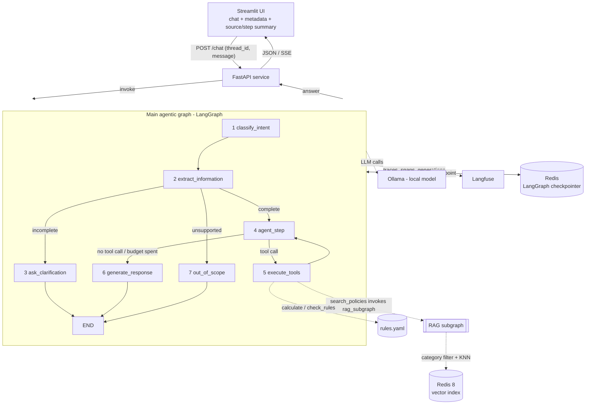
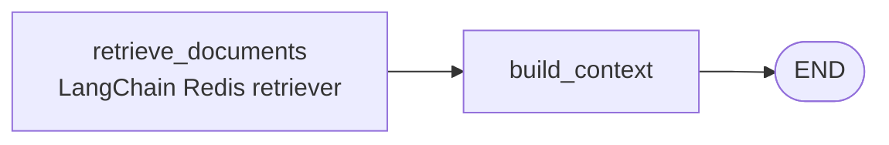

# Technical Design – Agentic RAG Expense & Benefits Assistant

Detailed technical plan for the idea described in [01-idea-plan.en.md](01-idea-plan.en.md).
Development process: [00-development-flow.en.md](00-development-flow.en.md).
This document defines what gets built, how the pieces fit together, and what each component's
contract is. It is the implementation reference.

---

## 1. Requirement traceability

| Assignment requirement | Where it is satisfied |
| --- | --- |
| Real problem + justification | [01-idea-plan.en.md](01-idea-plan.en.md), README §1 |
| LangChain/LangGraph implementation | §4–§9 – LangChain documents, splitters, embeddings, Redis retriever, chat model and tools inside compiled LangGraph workflows |
| LangGraph agentic workflow, ≥5 nodes | §6 – focused main graph with 7 nodes |
| Autonomous decision making (conditional routing) | §6.3 – ReAct tool-calling loop: the LLM picks the tools and their arguments; §6.4 – `route_after_agent` |
| Decomposition into subtasks | §6 – separate classification, extraction, deterministic routing, tool execution and response generation |
| State management for intermediate results | §5 – `AgentState`, checkpointed per thread |
| ≥2 tools, at least one non-retrieval | §7 – calculator, rule checker (deadline evaluation delegated internally, not a separate model-visible tool) |
| Dedicated modular RAG subgraph (not counted in the node budget) | §8 – compiled `rag_graph` (similarity search + category tag filter), invoked by the `search_policies` tool |
| Free-form text data source, quality over quantity | §4 – fictional `.docx` policy corpus (English) under `.docs/sources/en/`, header-aware chunking, single Redis vector index |
| No paid API, local open-source LLM + trade-off notes | §9 – Ollama + Qwen2.5-7B-Instruct, dummy LLM fallback |
| Streamlit UI showing the main steps and RAG result | §10.2 – streamed, expandable source and step summary; §11 – detailed diagnostics in Langfuse |
| Containerised, Dockerfile mandatory, compose preferred | §12 – root `Dockerfile` + compose with `api`, `ui`, `ollama`, `redis` |
| 10–20 question functional eval | §13 – version-controlled `llm_eval/dataset.<lang>.json`, executed as a Langfuse experiment |
| 50–200 query load test, latency, bottleneck, 1–2 optimisations | §14 |
| README with problem, architecture, results, run instructions | §16 – milestone M7 |

---

## 1.1 Note on scope and complexity

This design is intentionally limited to the smallest workflow that still demonstrates the assignment:
separate intent classification and extraction, deterministic clarification routing, an autonomous
tool loop, modular RAG and grounded response generation. Technical work that does not strengthen one
of those behaviours stays out of the graph.

**Framework boundary:** the implementation is LangChain/LangGraph end to end. LangChain owns
documents, splitters, embeddings, vector-store retrieval, prompts, chat-model calls, structured
output, messages and tools; LangGraph owns state, conditional execution, tool dispatch, checkpointing
and streaming. Custom code is limited to domain models, policy calculations, validation, formatting
and thin framework adapters where the source format requires one. It must not introduce a second
workflow engine, retriever abstraction, tool protocol, model client or conversation-memory layer.

## 1.2 Hard constraint: it has to run on one developer machine

The single most shaping constraint of this design is not a requirement in the brief, it is the hardware:
**everything must run on my own machine** — one CPU box (WSL2), no GPU cluster, no paid API, alongside the
editor and the browser, and it must still answer in a time a demo can survive. Most of the technology choices
below are downstream of that, and they are only defensible with it in mind:

| Choice | Because of the constraint |
| --- | --- |
| 7B model at Q4 (§9) | ~5 GB resident; a 14B or 70B would not fit next to everything else, and CPU generation would leave the demo unusable |
| 384-dim small multilingual embedder (§4.3) | ~470 MB and a fast CPU forward pass, while retaining cross-lingual retrieval for Hungarian questions over the English knowledge base |
| Corpus of 8 short English documents (§4.1) | a few hundred chunks, which is also why a dense-only, filter-first retrieval path is enough |
| Redis 8 as the only datastore (§4.3) | one datastore instead of three, and an in-memory index this size costs megabytes |
| One `uvicorn` worker, load test at concurrency 2–4 (§14) | Ollama serialises generation on one machine; higher concurrency measures queueing, not capacity |
| LangChain-compatible `DummyLLM` backend (§9) | the graph, the API and the tests must be runnable — and CI-able — without the model loaded at all |
| Simple RAG, no reranker (§8) | a cross-encoder pass would cost more CPU than it can earn back on this corpus |

Stated plainly because it changes how the numbers in §14 should be read: the bottleneck analysis describes a
laptop-class deployment, not a tuned server. A GPU host would move the bottleneck and would justify different
choices in almost every row above — bigger model, bigger embedder, a reranker.

---

## 2. Architecture overview



**The agent runs in a FastAPI service; Streamlit is only a client.** The UI imports no graph code —
it talks HTTP. That keeps the agent independently callable (curl, the eval harness, another
front-end), exposes a simple endpoint for triggering the Langfuse dataset load experiment, and
matches the brief's preference for a multi-component compose setup.

Two-layer knowledge design, and the single most important design decision in the project:

- **Prose policies** (`.docs/sources/<lang>/*.docx`) are the RAG corpus – they answer "what does the rule
  say", and provide citations.
- **Machine-readable rule catalogue** (`rules.yaml`) drives the deterministic tools –
  limits, rates, thresholds, deadlines. The LLM never invents or copies a policy number into a tool
  call; the deterministic implementation selects the applicable rule from the validated claim and
  catalogue, then computes.

Both describe the same fictional policy set and are kept in sync by a consistency test (§13.4), so a
citation always backs the number that was calculated. **In this PoC `rules.yaml` is hand-authored** —
see §4.5 for why, and for what a non-PoC version would do instead (derive it from the documents).

---

## 3. Repository layout

The current repository is:

```
.env.example              # committed application-setting template; .env is local and ignored
Makefile                  # install, quality, Sonar and local run commands
src/
  app/                       # the deployed application package (src layout: keeps it out of the
                              # repo root, alongside the standalone llm_eval/ and load_test/ tools)
    main.py                    # FastAPI app assembly and lifespan boundary
    dependencies.py            # typed dependency container, runtime wiring and providers
    settings.py                # pydantic-settings runtime configuration
    ui.py                      # Streamlit chat client
    api/
      router.py                  # combines the route modules
      schemas.py                 # HTTP request/response contracts
      routes/
        health.py                  # liveness/readiness endpoints
        chat.py                    # chat, streaming and thread-reset endpoints
        ingest.py                  # corpus/rule-catalogue ingest endpoint
        stats.py                   # policy index size and per-category chunk counts
        evaluation.py              # internal single-turn evaluation endpoint used by llm_eval/run_eval.py
    agent/
      service.py                 # invoke, stream and reset use cases exposed to the API
      responses.py                # graph state -> ChatResponse/EvaluationResponse
      streaming.py                # graph node updates -> public SSE step/source/token events
      graph.py                   # node/routing assembly and compilation
      nodes.py                   # node callbacks, including classify_intent
      state.py                   # LangGraph AgentState contract
      model.py                   # expense-claim Pydantic domain contracts
      static_texts.py             # fixed non-LLM-generated user-facing strings
      message_history.py         # messages/tool-call facts scoped to the latest request
      calculator.py              # deterministic reimbursement-calculation module
      deadline.py                # submission-deadline check
      rule_checker.py            # receipt/supporting-document rule checks
      slots.py                   # required-slot lookup per (intent, category)
      structured.py               # structured-output value + fallback-used flag
      tools.py                    # LangChain tool adapters over calculator/deadline/rule_checker
      prompts.py                  # embedded PoC prompt templates
      prompt_library.py           # Langfuse-resolved-vs-embedded prompt resolution
      tests/                      # co-located unit tests for this package
    integrations/
      llm.py                     # ChatOllama/FakeListChatModel factory
      redis.py                   # Redis connection, build-info and index-stat operations
      checkpointer.py            # Redis-backed LangGraph checkpointer (sync + async)
      ollama.py                  # Ollama reachability/model-pulled readiness check
      readiness.py               # aggregates LLM + Redis readiness behind /ready
      langfuse.py                # Langfuse client, trace metadata and prompt-resolution access
      tests/                     # co-located unit tests for this package
    logging/
      config.py                  # stdout + UTC-midnight rotating-file JSON logging, retention cleanup
      tests/                     # co-located unit tests for this package
    rag/
      graph.py                    # retrieve -> context subgraph
      state.py                    # LangGraph RagState contract
      model.py                    # retrieval/ingestion Pydantic contracts
      retriever.py                # vector-store retriever with per-call category filter
      store.py                    # query:/passage: prefixing for the embedding model
      tool.py                     # search_policies tool wrapping the RAG subgraph
      index_schema.py             # Redis index field/vector-dimension schema
      tests/                      # co-located unit tests for this package
      ingest/                     # corpus/rule-catalogue ingestion, not the retrieval path
        pipeline.py                 # load, chunk, validate and upsert the corpus into Redis
        chunker.py                  # header-aware, table-preserving Markdown chunker
        docx_loader.py              # LangChain loader for the .docx corpus
        docx_converter.py           # .docx -> Markdown conversion
        rule_metadata.py            # attaches section_id/rule_ids/categories, validates rules.yaml anchors
        build_info.py               # corpus build info used to decide whether ingestion can be skipped
        errors.py                   # corpus conversion/chunking/cross-check exceptions
        tests/                      # co-located unit tests for this package
    rules/
      loader.py                   # rules.yaml loading and validation
      model.py                    # rule-catalogue Pydantic contracts
      tests/                      # co-located unit tests for this package
    tests/
      fakes.py                    # shared test doubles (ScriptedChatModel, tool/document builders)
      test_dependencies.py        # app/dependencies.py DI container
      api/                        # full-HTTP-stack tests exercised through app.main
      journeys/                   # cross-module compiled-graph and rule/document-consistency integration tests
  rules_config/
    rules.yaml                  # small language-independent deterministic rule catalogue
llm_eval/                    # standalone functional-evaluation CLI script, not a formal package (no __init__.py, no tests)
  dataset.json               # 20 functional test cases; source of truth
  model.py                   # EvalCase/EvalDataset contracts and validation errors
  metrics.py                 # per-case/aggregate evaluation metrics, including the answer_quality judge
  report.py                  # Markdown/JSON local report generation
  dataset_sync.py            # syncs dataset.json to the Langfuse dataset
  judge.py                   # AnswerJudgeVerdict + judge prompt for the answer_quality metric
  run_eval.py                # sync dataset + run Langfuse experiment + local reports
load_test/                   # standalone load-test CLI script, not a formal package (no __init__.py, no tests)
  load.py                    # LoadTestRunner + LoadTestResult + CLI entry point
Dockerfile
docker-compose.yml         # per-service commands live here;
pyproject.toml             # project metadata, dependencies, Ruff/Bandit/pytest/coverage configuration
uv.lock                    # pinned, reproducible dependency lock file (committed)
sonar-project.properties   # Sonar source, test and coverage paths
evaluation_results/        # eval/load-test results (README §8/§9 point here; not embedded inline)
README.md
```

Unit tests inside the `src/app/` package are co-located with the module they cover, under a `tests/`
subfolder inside that sub-package (`src/app/agent/tests/test_calculator.py` covers
`src/app/agent/calculator.py`). A test's location names the module it exercises without a separate
mirrored tree to keep in sync. Two kinds of tests don't belong to a single sub-package and stay
under `src/app/tests/` instead: `src/app/tests/journeys/` holds full compiled-graph journeys and
rule/document-consistency checks that exercise `agent`, `rag` and `rules` together, and
`src/app/tests/api/` holds tests that exercise the HTTP surface end-to-end through `app.main` rather
than importing `app.api.routes.*` directly. `src/app/tests/fakes.py` holds test doubles shared across
all of these locations, imported everywhere as `from app.tests.fakes import ...` — which is also why
`src/app/tests/` and every sub-package `tests/` subfolder carry an `__init__.py`.

`llm_eval/` and `load_test/` are the two exceptions to that package structure, and the only parts of
the repository with no unit tests at all: each is a standalone CLI script users run directly
(`python -m llm_eval.run_eval`, `python -m load_test.load`) against a live Redis/Ollama/Langfuse
stack, not app logic exercised by the deployed request path, so neither carries an `__init__.py` nor
a `tests/` subfolder — they are validated by running them, not by a mocked unit-test suite (§13.4).
`load_test/` in particular used to be `app/loadtest/` (back when `app/` itself lived at the repo
root, before the `src/` layout below), invoked as an `/admin/load-test` endpoint
inside the live FastAPI process; it moved out to a standalone script (§14) specifically so a crash
or resource exhaustion during a load run cannot take real `/chat` traffic down with it.

`pytest` discovers tests via `testpaths = ["src/app"]`, resolving the `app` import through
`pythonpath = [".", "src"]` (the `.` entry is what lets `llm_eval/`/`load_test/` import `app.*` while
staying outside `src/` themselves). `llm_eval/` and `load_test/` are outside pytest's `testpaths`
scope entirely, so coverage (`source = ["app"]` — the import name, unaffected by the `src/` move)
never touches either. Sonar configuration explicitly
excises the co-located `src/app/**/tests/` subfolders from source-code accounting so they are measured as
tests, not counted as application code. `load_test/load.py` stays in the Sonar and Bandit source scan
(it is still real code worth static analysis, even without tests); `llm_eval/` stays outside all of
it, matching its existing scope as a dev tool rather than shipped production code.

Dependency management uses `uv` directly: runtime dependencies live in `[project.dependencies]` and
development/quality-tool dependencies in `[dependency-groups.dev]`, both inside `pyproject.toml`;
`uv.lock` is the single pinned, reproducible lock file. This replaces the originally planned
`requirements.in`/`requirements.txt` (+ `-dev`) pip-tools pattern — `uv` already owns compilation and
locking, so a second pinning mechanism would be redundant. `uv sync --dev` reproduces the exact
environment from a clean clone.

Application settings are documented in `.env.example` and loaded from the ignored `.env` by
`pydantic-settings`. The committed template contains no credentials. The local development file may
select `LLM_BACKEND=dummy`, loopback URLs and disabled Langfuse without changing source code.

All endpoint functions live under `src/app/api/routes/`. `src/app/api/router.py` only combines their
`APIRouter` instances, and `src/app/main.py` only assembles the FastAPI application and owns its
lifespan. `src/app/dependencies.py` owns runtime wiring through a typed `ApplicationDependencies`
container and exposes the small FastAPI providers used by routes. The lifespan builds this container
once and stores it as `app.state.dependencies`; imports perform no resource creation. This keeps
transport code out of both the application entry point and the agent workflow.

New application behaviour is organised around small, cohesive classes. Ad hoc module-level helper
functions and boilerplate getters/setters are avoided; framework-required entry points are the
exception. Dependency-injection providers and runtime wiring remain centralised in
`src/app/dependencies.py`. Each future domain module keeps its Pydantic contracts in that module's
`model.py`; the shell's existing `src/app/api/schemas.py` remains the current transport-contract file
until the API module is expanded. Source files do not use file-level or module-level docstrings.

---

## 4. Data layer

### 4.1 Corpus

The policy documents describe a fictional company, are used only for this prototype, and have no
legal or tax validity. The source-pack README files and the UI disclaimer make that boundary clear.

**One corpus, one index.** The knowledge base is the English policy corpus under
`.docs/sources/en/`; ingest builds a single Redis index (`idx:chunks`) from it. The corpus language
does not constrain the chat model to English: multilingual model and embedding capabilities allow
Hungarian questions to be handled on a best-effort basis against the same English source material.

The source pack contains eight **`.docx`** files:

| File | Content |
| --- | --- |
| `00_Document_Index_and_Glossary.docx` | document index and domain glossary |
| `01_General_Expense_Reimbursement_Policy.docx` | general eligibility and reimbursement rules |
| `02_Business_Travel_and_Accommodation_Policy.docx` | business travel, accommodation and related expenses |
| `03_Commuting_Support_Policy.docx` | commuting support and public transport |
| `04_Personal_Vehicle_for_Business_Use.docx` | mileage, private vehicle use, parking and tolls |
| `05_Employee_and_Recreational_Benefits.docx` | employee, recreation and training benefits |
| `06_Receipt_and_Approval_Requirements.docx` | receipts, approvals and submission requirements |
| `07_FAQ_and_Example_Cases.docx` | short questions and worked examples |

The `00`–`07` prefix is the stable `doc_id`.

The source folder remains unchanged. Small retrieval metadata lives beside the deterministic rules in
`src/rules_config/rules.yaml`, keyed by `doc_id`:

```yaml
documents:
  "01":
    categories: [general, meal, equipment]
    sections:
      business-meal-limit:
        headings: ["4. Business meals"]
```

The section key is a stable anchor used by `doc_ref` (`01#business-meal-limit`). During
normalisation, the heading path resolves to that anchor; ingest then attaches the ids of rules whose
`doc_ref` points to it. Ingest fails on an unknown document prefix, empty category list, unresolved
heading path or rule reference. This avoids deriving stable ids from heading text that might be
edited later.

### 4.2 Loading and chunking

**`.docx` → Markdown normalisation comes first.** A header-aware Markdown splitter is the right tool
for this corpus, but only if the heading structure survives the load. A plain text extraction
(`docx2txt`, `UnstructuredWordDocumentLoader` in text mode) flattens Word headings into ordinary
paragraphs — after that a `MarkdownHeaderTextSplitter` has nothing to split on and silently degrades to
fixed-size chunks, which destroys the "one chunk = one rule section" property the citations and the
`rule_ids` metadata depend on.

So `src/app/rag/ingest/docx_loader.py` uses a small `python-docx` normaliser behind LangChain's
`BaseLoader` interface.
It emits LangChain `Document` objects whose `page_content` is Markdown and whose `metadata` contains
the source identity. This adapter exists only because the generic Word loaders discard the heading
information required by this corpus; all subsequent document processing uses LangChain:

**A heading-preserving library could have replaced this converter.** Candidates considered:

- **`pandoc`** (via `pypandoc`) — excellent, battle-tested docx → Markdown conversion that keeps
  headings, lists and tables. Rejected because it is an external, non-Python binary: another system
  dependency to bake into the Docker image and pin/patch independently of `uv`'s Python lockfile, for
  a corpus of 8 fixed, hand-authored files.
- **`markitdown`** (Microsoft, wraps `mammoth`) or `mammoth` directly — pure Python, converts docx to
  Markdown preserving heading structure. Rejected because it is a general-purpose, multi-format
  converter (pptx, xlsx, images, audio transcription for `markitdown`) pulled in for a single narrow
  need, and its Markdown table output is not obviously the exact GFM syntax `MarkdownHeaderTextSplitter`
  and the "one chunk = one rule section" invariant depend on — that fidelity would need the same kind
  of verification this PoC's own `_table_to_markdown` already guarantees by construction.
- **`unstructured`** (`partition_docx`, used directly rather than through LangChain's text-mode
  loader) — classifies elements (`Title`, `NarrativeText`, `Table`, `ListItem`, ...) instead of
  flattening to plain text, so it does not have the `docx2txt`/text-mode problem above. Rejected here
  because turning that element stream into a heading-hierarchy Markdown string is close to the same
  amount of mapping code this PoC already wrote, while adding a much heavier dependency surface (OCR,
  PDF and other format extras) that this corpus never needs.
- **`docling`** (IBM) — converts docx to Markdown with headings preserved via its own document model;
  a strong fit in principle. Rejected for the same reason as `unstructured`: a heavier, actively
  evolving dependency (bundled layout/model tooling) for a conversion need fully satisfied by ~60 lines
  of `python-docx` against a small, stable set of known Word styles (`Heading 1..3`, `Title`,
  `List Bullet`/`List Number`).

None of these would be the wrong choice for a corpus that grows past a handful of files or gains
inconsistent authors; for 8 fixed, single-author documents, the bespoke converter is easier to test,
has no external output-format drift to guard against, and adds zero new runtime dependencies beyond
`python-docx`, which every alternative above still needs (or wraps) to read Word styles in the first
place.

| Word element | Markdown output |
| --- | --- |
| paragraph style `Heading 1..3` | `#` / `##` / `###` + text |
| `Title` | document `#` heading (falls back to the file name) |
| normal paragraph | plain paragraph |
| list paragraphs (`List Bullet`, `List Number`) | `-` / `1.` items |
| table | GitHub-style Markdown table, emitted as one block |
| everything else (images, headers/footers, comments, tracked changes) | dropped |

`markitdown` or `mammoth` (docx → HTML → Markdown) are the alternatives; `python-docx` is chosen
because the mapping above is ~60 lines, has no extra service dependency, and gives exact control over
tables, which contain policy limits and examples used by the tools.

Then the split, on Markdown, whatever the source format was:

- LangChain `MarkdownHeaderTextSplitter` on `#`/`##`/`###`, so a chunk boundary is a rule boundary and the
  heading path becomes the `section` metadata.
- LangChain `RecursiveCharacterTextSplitter` (`chunk_size=800`, `chunk_overlap=120` characters) as a size guard
  for over-long sections only.
- **Tables are never split**: a table block is kept whole even if it exceeds `chunk_size`; half a rate
  table is worse than a long chunk.
- Sections shorter than ~200 characters (typical in document `07`) are merged with the following sibling, so
  a chunk is never a bare heading.

One chunk ideally equals one rule section, which makes citations precise and keeps top-4 similarity
search sufficient without a reranking step.

The normalised Markdown stays in memory during ingest. Conversion behaviour is covered by tests;
the repository keeps only the original DOCX source files.

Chunk metadata (also the citation payload):

```python
{
  "doc_id": "03",
  "doc_title": "Commuting allowance policy",
  "section_id": "distance-based-bands",
  "section": "Distance-based bands",
  "rule_ids": ["R-COMM-02"],
  "categories": ["commuting"],
  "chunk_index": 7,
  "source_path": ".docs/sources/en/03_Commuting_Support_Policy.docx"
}
```

The title is derived from the document, and `categories`, the stable section anchor and `rule_ids`
come from the validated `rules.yaml` mapping above.

**Category tag filtering is the retrieval-precision mechanism of this design** (see §8). The active
category and `general` are a Redis TAG pre-filter inside the KNN query:

```
(@categories:{commuting|general})=>[KNN 4 @embedding $vec AS score]
```

Consequently every chunk must carry an accurate `categories` list. Ingest validates the document
metadata in `rules.yaml` before embedding anything, and a test asserts that every category has at
least one indexed chunk.

### 4.3 Indexing

- Embeddings: LangChain `HuggingFaceEmbeddings` from `langchain-huggingface`, configured with
  `intfloat/multilingual-e5-small` (384 dims, ~470 MB, 100+ languages; `query:` / `passage:`
  prefixes configured once in the embedding factory). The model id and revision are pinned
  constants. Its multilingual capability supports cross-lingual Hungarian queries over the English
  corpus (see below).
- Store: **Redis 8** (`redis:8.8.1`), the single datastore of the project — the vector
  index and LangGraph checkpoints live in it, addressed by key namespace. Redis was chosen not only
  for its vector-search capability, but also because it is a mature, proven general-purpose database
  for application state. Documents are written and queried through LangChain's Redis vector-store
  integration; conversation state uses LangGraph's `RedisSaver`. Application code does not issue raw
  RediSearch commands or implement its own vector store. The integrations may share an underlying
  Redis connection pool where their supported constructors allow it.
- Retrieval is dense-only: the LangChain Redis vector store performs KNN with a metadata tag
  pre-filter. No lexical/BM25 index and no
  fusion — on a corpus of this size and with a category filter already narrowing the candidate set,
  a second index would add moving parts without a measurable precision gain. `text` and `rule_ids`
  remain indexed as TEXT/TAG metadata, but the application exposes no second, raw-Redis retrieval
  path.

#### Why use a multilingual embedding model for an English knowledge base

`intfloat/multilingual-e5-small` was selected because it combines retrieval-oriented
(`query:`/`passage:`) training, low CPU and memory cost, and useful cross-lingual retrieval. The
indexed policies remain English, but a user may formulate a question in Hungarian and still retrieve
the relevant English passages. This is best-effort capability rather than a separately localised and
evaluated Hungarian knowledge base. At 384 dimensions and ~470 MB, the model is small enough to be
effectively invisible next to the local LLM: one image-baked download, one lifespan warm-up and a
query embedding costing a fraction of a generation call.

If retrieval hit rate disappoints at M7, the upgrade path is a bigger multilingual model rather than a
different architecture:

| Model | Dims | Size | When it makes sense |
| --- | --- | --- | --- |
| `intfloat/multilingual-e5-small` (default) | 384 | ~470 MB | CPU-only prototype, this corpus size |
| `intfloat/multilingual-e5-base` | 768 | ~1.1 GB | first upgrade — same family, same prefixes, just stronger |
| `Qwen3-Embedding-0.6B` | 1024 (Matryoshka-truncatable) | ~1.2 GB (fp16) | best multilingual quality of the three; instruction-aware queries, and the dimension can be truncated to 512/256 to keep the index small. Costs ~5× the forward pass of e5-small on CPU and competes with the LLM for RAM — worth it if the eval shows retrieval, not generation, is the weak link |
| `BAAI/bge-m3` | 1024 | ~2.2 GB | strong multilingual retrieval, but the heaviest option and no advantage this corpus can show |

Switching requires changing the pinned model constant and re-ingesting: the index stores its model,
revision and `DIM` in `manifest:corpus`, so a changed model rebuilds it instead of silently mixing
vector generations.

Index and keys:

```
key:    chunk:{doc_id}:{chunk_index}    # HASH
fields: text, embedding (FLOAT32 blob), doc_id, doc_title, section,
        section_id, categories (tag, "|"-separated), rule_ids (tag), chunk_index, source_path

FT.CREATE idx:chunks ON HASH PREFIX 1 chunk: SCHEMA
  text        TEXT
  doc_id      TAG
  section_id  TAG
  categories  TAG SEPARATOR "|"
  rule_ids    TAG SEPARATOR "|"
  section     TEXT NOSTEM
  embedding   VECTOR HNSW 6 TYPE FLOAT32 DIM <dim of EMBEDDING_MODEL> DISTANCE_METRIC COSINE
```

| Key namespace | Purpose | TTL |
| --- | --- | --- |
| `chunk:*` + `idx:chunks` | corpus chunks and the vector index | none |
| `manifest:corpus` | hash of corpus + chunking params + embedding model | none |
| `checkpoint:*` | LangGraph conversation state (§5) | 24 h |

- Ingest (`python -m app.rag.ingest`) reads `.docs/sources/en/` and builds the index: convert →
  chunk → embed → upsert in a pipeline (batch 128). Idempotent: `manifest:corpus` holds the hash of
  the corpus + chunking params + embedding model; on mismatch it drops the index
  (`FT.DROPINDEX idx:chunks DD`) and rebuilds it. The app never embeds the corpus at request time.
- `DIM` is derived from the embedding model at ingest time and stored in the manifest, so switching
  models cannot leave a dimension-mismatched index behind.
- Durability: AOF (`appendonly yes`) on a named volume. Losing Redis costs the index (rebuildable in
  one ingest run, ~seconds for this corpus) and open conversations — acceptable for a prototype, and
  the app rebuilds on boot.

### 4.4 `rules.yaml` shape

```yaml
version: 1
currency: HUF
fx_rates_fixed: { EUR: 400, USD: 370 }        # fictional, no external FX API
documents:
  "00": { categories: [general] }
  "01": { categories: [general, meal, equipment] }
  "02": { categories: [travel] }
  "03": { categories: [commuting] }
  "04": { categories: [mileage] }
  "05": { categories: [benefits] }
  "06": { categories: [general] }
  "07": { categories: [general] }
submission:
  deadline_days: 30
  deadline_rule_id: SUBMISSION-DEADLINE
  deadline_doc_ref: 01#submission-deadline
  approval_rule_id: SUBMISSION-APPROVAL
  approval_doc_ref: 06#approval-matrix
  receipt_rule_id: SUBMISSION-DOCUMENTS
  receipt_doc_ref: 06#acceptable-documents
  approval_tiers:
    - { max_huf: 50000, approver: line_manager }
    - { max_huf: 150000, approver: department_head }
    - { max_huf: null, approver: finance_director }
categories:
  meal:
    rules:
      - id: R-MEAL-01
        limit_per_person_huf: 15000
        doc_ref: 01#business-meal-limit
      - id: R-MEAL-02
        doc_ref: 01#business-meal-limit
        excluded_items: [alcohol, tobacco, tips, personal consumption]
    required_documents: [invoice, business_purpose_note, participant_list]
    required_documents_rule_id: MEAL-REQUIRED-DOCUMENTS
    required_documents_doc_ref: 01#business-meal-limit
  commuting:
    rules:
      - id: R-COMM-01
        min_one_way_km: 10
      - id: R-COMM-02
        rate_huf_per_km: 30
        monthly_cap_huf: 40000
      - id: R-COMM-03
        pass_reimbursement_ratio: 0.8
    required_documents: [route_declaration, monthly_attendance_summary]
  mileage: { ... }
  equipment: { ... }
  benefits:
    rules:
      - id: R-BEN-01
        benefit_type: recreational
        annual_budget_huf: 120000
      - id: R-BEN-TENURE
        doc_ref: 05#benefits-eligibility
        eligible_after_months: 6
      - id: R-BEN-CARRY-OVER
        doc_ref: 05#benefits-eligibility
        carry_over: false
```

The FastAPI lifespan loads it once into a pydantic `RuleCatalogue` and passes that dependency to the
calculator and rule-checker modules through `src/app/dependencies.py`. Typed accessors expose values such
as `rules.meal.limit_per_person`. A missing or malformed rule raises at startup, not mid-request.

### 4.5 `rules.yaml` is hand-authored — and would not be in a real system

Root `rules.yaml` is written by hand for the PoC. Worth stating plainly, because it is
the one place where the prototype is better prepared than a real system would be.

Why: with the numbers fixed, a wrong calculation has one possible cause — the tool. If the limits came from an
LLM extraction step, the eval's calculation metric could not tell bad extraction from a bad tool.

What a non-PoC version would do instead: **generate the catalogue from uploaded policy documents.**
Unlike the deliberately structured source pack used by this PoC, real uploaded documents would likely have
inconsistent headings, layouts and file formats, so the production ingestion pipeline would first detect and
normalise their structure. An offline LLM pass over the resulting sections proposes rules into the same
pydantic schema, each with the `doc_ref` it came from. A rule is only accepted if its number appears verbatim
in the cited section — the consistency test of §13.4 used as a gate — and the resulting diff is reviewed by a
human before the catalogue is versioned. At runtime nothing changes: the tools still read a validated
catalogue, never raw LLM output.

It is out of scope here because an extraction pipeline plus a review workflow is a project of its own, and
none of it improves the agentic behaviour this assignment is graded on.

---

## 5. State

Rule for what goes in: **state holds only what a later node reads and cannot cheaply recompute.**
Anything derivable is a function, anything only humans read is a trace event. A checkpointed state is
also a serialisation contract — every extra key is another thing to migrate and another way for two
nodes to disagree about the same fact.

LangGraph state contracts live in each workflow package's dedicated `state.py` module; Pydantic
domain and transport contracts remain in `model.py`.

```python
class AgentState(TypedDict, total=False):
    messages: Annotated[list[BaseMessage], add_messages]  # LangChain messages: question, tool calls, results, answers
    intent: Intent                                        # set once per turn, gates node 3
    category: Category | None                             # current classifier output
    claim: ExpenseClaim                                   # current or clarification-pending claim
    decision: Decision | None                             # eligible | partially_eligible | not_eligible | needs_info | out_of_scope
```

Why these five and nothing more:

- **`messages`** is the working memory of the ReAct loop (§6.3): the question, the agent's tool calls, the
  `ToolMessage` results and the answer. The answer therefore needs no key of its own — it is `messages[-1]`.
- **`intent`** gates node 3 and shapes the required-slot table; set once per turn by the dedicated
  classifier.
- **`category`** holds the current turn's classifier output without mutating a clarification-pending
  claim before node 2 decides whether the new message continues it.
- **`claim`** is the only thing that must survive the turn boundary: clarification works by merging slots
  across turns (§6.5), and re-deriving it would mean re-running the extraction LLM call — expensive and
  non-deterministic.
- **`decision`** is derived deterministically from typed tool artifacts inside `generate_response`
  before the answer prompt runs, making it directly measurable without a separate graph node or
  parsing answer prose.

The rest of a turn's data has a home outside state:

| Data | Home |
| --- | --- |
| Calculation, rule findings, retrieved chunks | the `artifact` of the corresponding current-turn `ToolMessage` — tools declare `response_format="content_and_artifact"`, so `content` is the compact summary the model reads and `artifact` is the typed pydantic result the eval reads |
| Loop counters | counted only from the current-turn message slice: agent steps = AI messages with tool calls and failed calls = `ToolMessage`s with `status="error"`, with `recursion_limit` as the hard backstop |
| Traces and timings | the Langfuse callback handler (§11) — observability does not belong in a checkpoint a later turn reloads |

One consequence to respect in implementation: because the LLM sees `messages`, `ToolMessage.content` must stay
a short summary ("reimbursable 75,000 HUF, cap 75,000, excess 0"). The compact typed result travels in
`artifact`, which is never sent to the model — that is what keeps a growing transcript from becoming a growing
prompt.

`ExpenseClaim` (pydantic, every field optional so it can be filled incrementally):

```python
category, expense_type, amount_huf, headcount, expense_date, distance_km,
distance_is_one_way, commute_days_per_month, non_reimbursable_amount,
has_receipt, provided_documents, approval_obtained, annual_budget_used_huf,
tenure_months, is_business_related, is_international_trip
```

The classifier normalises accommodation, taxi and business-travel parking to category `travel`,
while preserving the subtype in `expense_type`. Trip scope and business eligibility remain explicit
facts (`is_international_trip`, `is_business_related`) instead of being encoded in subtype strings.
This keeps retrieval filtering aligned with category metadata without coupling deterministic rules
to prompt-specific naming conventions.

**A request starts at the latest `HumanMessage`.** `MessageHistory.messages()` returns that suffix and is
the only input used for loop counts, duplicate-call detection, tool-artifact projection and final
decision derivation. The classifier, extractor, agent-step and answer prompts do not see the raw
transcript either: `MessageHistory.model_context()` condenses every completed previous request down
to its `HumanMessage` and final (non-tool-calling) `AIMessage`, dropping that request's own
`ToolMessage`s and intermediate tool-calling `AIMessage`s, while keeping the current request's
messages in full. This keeps enough conversational context for continuity (what was asked, what was
answered) without letting a model reuse a previous request's tool evidence as if it were current, and
without the context growing unbounded with old tool payloads. Operational decisions cannot
accidentally inspect a previous request's tools either way, since they read `MessageHistory.messages()`
(current request only), not `model_context()`.

**Slot merging across turns is only for clarification.** The classifier writes the new result to
`intent` and `category`, never into `claim`. Before extraction overwrites the previous decision, it
checks whether that decision was `needs_info` and whether the new intent/category is compatible with
the pending claim. Only then does `merge_claim(old, new)` keep previously known values; otherwise
the new extraction, enriched with the classified category, replaces the old claim. Extraction then
clears the previous decision before routing the current request. This lets a clarification answer
complete the pending claim while a new question in the same thread starts cleanly. State is
persisted by the
**Redis checkpointer**
(`langgraph-checkpoint-redis`, `RedisSaver`) keyed by `thread_id = streamlit session id`, under the
`checkpoint:*` namespace with a 24 h TTL. Redis rather than SQLite because it is already the
project's datastore, it survives container restarts without a mounted file, and it lets several
Streamlit workers share one conversation store. Redis is required at startup; the API fails fast
rather than serving chat without policy retrieval or durable conversation state.

---

## 6. Main graph

The workflow is built with LangGraph `StateGraph`, compiled with the LangGraph checkpointer and
invoked/streamed through the compiled graph API. Nodes exchange LangChain message objects; there is
no parallel home-grown workflow runner, message schema or conversation-memory implementation.

### 6.1 Nodes

| # | Node | LLM | Responsibility | Writes |
| --- | --- | --- | --- | --- |
| 1 | `classify_intent` | yes (structured) | dedicated intent + category classification, with confidence recorded in Langfuse; never mutates the previous claim | `intent`, `category` |
| 2 | `extract_information` | yes (structured) | extract current request with conversation context; merge only when continuing a pending clarification, otherwise replace; clear the previous decision | `claim`, `decision=None` |
| 3 | `ask_clarification` | no | render a deterministic focused question for the top missing slot | `messages`, `decision=needs_info` |
| 4 | `agent_step` | yes (tool calling) | **the autonomous decision**: select a tool and its arguments or stop | `messages` (AI message with tool calls) |
| 5 | `execute_tools` | no | LangGraph `ToolNode` executes the selected LangChain tool; `search_policies` invokes the RAG subgraph | `messages` (`ToolMessage` with typed artifact) |
| 6 | `generate_response` | yes | derive the typed decision from tool artifacts, then generate the grounded employee-facing answer | `decision`, `messages` |
| 7 | `out_of_scope` | no | canned refusal + scope explanation | `messages`, `decision=out_of_scope` |

Seven nodes satisfy the required five without treating routing, input trimming, observability or response
serialization as graph work. The RAG subgraph remains separate and is not counted. The Langfuse
callback observes every node without adding diagnostics to state.

`execute_tools` is a LangGraph `ToolNode`, configured with the registered LangChain tools and the
project's validation/error handler. It dispatches the tool selected by `agent_step`, appends a
`ToolMessage` and hands control back to node 5. Each `ToolMessage` carries a compact summary as its `content` (what the model reads)
and the typed pydantic result as its `artifact` (what the eval reads) — structured data without a
second copy in state, and without parsing prose. See §5.

### 6.2 Required-slot table (`missing()`, evaluated after node 2)

| intent / category | required slots |
| --- | --- |
| `policy_question` (any) | – |
| `document_requirements` | `category` |
| `expense_check` / `meal` | `amount_huf`, `headcount`, `is_business_related`, `non_reimbursable_amount` |
| `expense_check` / `travel` | `expense_type`, `amount_huf`, `is_business_related`, `is_international_trip` |
| `expense_check` / `equipment` | `amount_huf`, `is_business_related` |
| `calculation` / `mileage` | `distance_km`, `distance_is_one_way` |
| `calculation` / `commuting` | `distance_km`, `distance_is_one_way`, `commute_days_per_month` |
| `expense_check` / `benefits` | `expense_type`, `amount_huf`, `annual_budget_used_huf`, `tenure_months` |
| `deadline_check` | `expense_date` |

Ambiguity counts as missing: if `distance_is_one_way` is `None`, the assistant asks – this is the
canonical demo of "does not guess" behaviour.

### 6.3 Tool selection is the agent's decision (node 4)

There is no static intent→tool table. `agent_step` calls a LangChain chat model with tools attached
through `bind_tools()` and it decides,
each iteration, whether to call a tool and which one — a ReAct loop rather than a pre-computed plan:

```
agent_step  ──tool call──▶  execute_tools  ──ToolMessage──▶  agent_step  ──no tool call──▶  generate_response
     ▲                                                        │
     └────────────────── up to MAX_AGENT_STEPS (4) ───────────┘
```

The three LangChain tools it may call, as the LLM sees them (schemas in `src/app/agent/tools.py`, descriptions are part
of the contract because they are what the model actually reasons over):

| Tool | Arguments the agent chooses | Description given to the model |
| --- | --- | --- |
| `search_policies` | `query`, optional `category` | "Search the company policy documents. Use it whenever an answer depends on company policy. Pass the expense category when known." |
| `calculate` | none — the validated `ExpenseClaim` is read from graph state through the injected `ToolRuntime` (§7.1) | "Compute the reimbursable amount for the current claim. Never do arithmetic yourself. Search the policies first so the final answer has supporting evidence." |
| `check_rules` | the claim fields + retrieved `rule_ids` | "Check eligibility, caps, approval thresholds, receipt requirements and the submission deadline against the rule catalogue." |

Two consequences worth naming, because they are the point of the change:

- **Category is the only retrieval filter.** The agent may pass it explicitly; otherwise the tool
  uses the category produced by `classify_intent`. General documents are always included (§8).
- **The tool order is emergent.** The model typically searches, then calculates, then checks rules:
  retrieval supplies the evidence and citations, while calculation reads authoritative values from
  the validated catalogue. A deadline question can go straight to `check_rules`, and a follow-up in
  the same thread can skip the search when the relevant evidence is already in the transcript.

Guardrails, all deterministic and outside the LLM:

| Guardrail | Behaviour |
| --- | --- |
| Step budget | tool-calling AI messages ≥ `MAX_AGENT_STEPS` (4) → the loop exits to `generate_response` with whatever it has, and the answer states when evidence is incomplete |
| Invalid arguments | pydantic validation error is returned to the agent as the `ToolMessage`, so it can correct itself; the same tool may fail this way at most twice, then it is disabled for the turn |
| Repeated identical call | same tool with the same arguments → reuse the matching `ToolMessage` artifact in `MessageHistory.messages()` and record a warning, instead of executing it again |
| `calculate` with an incomplete claim | normally prevented by required-slot routing after extraction; the calculator still validates its category-specific requirements and returns a typed tool error rather than guessing |
| `unsupported` intent | never reaches the loop — the conditional edge after extraction routes it to `out_of_scope` |

The expected tool sequences (`["search_policies","calculate","check_rules"]` for an expense check,
`["check_rules"]` for a deadline question, …) still exist — but as **eval expectations**
(`expected_tools`, §13.1), not as control flow. That is precisely what makes tool-selection accuracy a
meaningful metric: it measures the model's decision instead of re-testing a lookup table.

The cost, stated for the README: an extra LLM call per tool step (§14 counts 4–7 calls per turn)
and more run-to-run variance than a planner would have. The functional eval records the exact
tool sequence in Langfuse, so a failed selection can be inspected without adding variance analysis
to the PoC report.

### 6.4 Conditional edges (`src/app/agent/graph.py`)

```python
def route_after_extraction(s):          # -> "ask_clarification" | "agent_step" | "out_of_scope"
def route_after_agent(s):               # -> "execute_tools" | "generate_response"
```

`route_after_agent` reads `tool_calls` off the last AI message. Any tool call goes to the generic
executor; no tool call goes to response generation. There is no plan or cursor to keep, which is why
the slimmed state (§5) needs no `route` key.

Loop safety is counted off `MessageHistory.messages()`, not the whole transcript or a counter key:
agent steps are current-turn AI messages with tool calls (max `MAX_AGENT_STEPS`), with graph
`recursion_limit=20` as the hard backstop. When the budget is exhausted, control moves to
`generate_response` rather than looping.

### 6.5 Clarification flow

Rather than blocking inside the graph, `ask_clarification` ends the turn (`-> END`) with
`decision=needs_info`. The checkpointer keeps the partial claim; the user's next message enters the
same thread, `extract_information` merges the new slots, and the run proceeds. This keeps a
request/response HTTP API and LangGraph in agreement about who owns the turn boundary, and it is
resumable after a restart. It is also why `claim` must be the only home of the extracted facts: the
merge happens in one place, on one key.

**The simpler option, and why it was not taken.** All of this could have been one sentence in the prompt —
"if something is missing, ask the user" — with no deterministic required-slot routing and no
`ask_clarification` node. That is genuinely less code, and a good model often does ask.

The reason for the explicit version: with the prompt-only variant, "does not guess" is a hope, not a property.
The model asks sometimes and invents a headcount other times, the same question behaves differently across runs,
and there is nothing to measure — the eval's clarification-correctness metric (§13.2) would be scoring the
weather. The slot table makes it deterministic: if `distance_is_one_way` is `None`, the assistant asks, every
time, and a missing question is a bug with a location.

The trade-off is honest, though: the table has to be maintained per (intent, category), and a question type
nobody added to it falls through to the agent, which is then back to prompt-only behaviour for that case.

---

## 7. Tools

Every agent-facing tool is a LangChain `StructuredTool` (declared with `@tool` where convenient) with
a pydantic argument schema, a precise description and `response_format="content_and_artifact"`.
Values already established by earlier graph nodes are read through LangChain's injected
`ToolRuntime`, which is hidden from the tool schema shown to the model and avoids a second
extraction-by-tool-call.
LangGraph's `ToolNode` is the only runtime dispatcher. The arithmetic and rule-checking implementations
under those wrappers remain dependency-free Python functions, unit-tested directly and callable by the
eval harness without an LLM. They never call the LLM and never read the network; only the
`search_policies` tool delegates to the compiled LangGraph RAG subgraph.

### 7.1 `reimbursement_calculator`

The calculator is deliberately a deep module: its external interface accepts the already validated
`ExpenseClaim`, while category dispatch, required-field validation, rule selection and formulas
remain inside the implementation. There is no second `CalcInput` containing
every category's mostly optional fields.

A sufficiently capable frontier model—for example Claude Opus, Fable or a GPT-5.6-class model—may
calculate these amounts and submission deadlines correctly in many individual prompts. The system
does not treat that capability as a control. Model arithmetic can vary with wording and context, is
harder to regression-test at exact boundary values, and may use an unstated assumption or a number
from retrieved prose. `ReimbursementCalculator` and `DeadlineChecker` instead use validated,
version-controlled rules and explicit typed inputs. Their outputs are reproducible, auditable and
covered by exact unit tests. The model remains responsible for intent, tool selection and natural
language explanation, while deterministic application code remains responsible for financial and
deadline arithmetic.

```python
class CalculationResult(BaseModel):
    amount_huf: int
    cap_huf: int | None = None
    excess_huf: int = 0
    warnings: list[str] = []

class ReimbursementCalculator:
    def __init__(self, rules: RuleCatalogue): ...
    def calculate(self, claim: ExpenseClaim) -> CalculationResult: ...
```

`RuleCatalogue` is loaded and validated once at startup and passed to the module; the module does not
read files or global configuration during a calculation. Its internal category-specific functions
(`_calculate_meal`, `_calculate_mileage`, `_calculate_commuting`, …) are implementation details, not
additional interfaces the graph or model must understand.

The LangChain adapter exposes an argument-free tool to the model. `ToolRuntime` is injected by
`ToolNode` and hidden from the generated tool schema, so the emitted tool call is simply
`calculate({})`:

```python
def build_calculate_tool(calculator: ReimbursementCalculator):
    @tool(response_format="content_and_artifact")
    def calculate(
        runtime: ToolRuntime,
    ) -> tuple[str, CalculationResult]:
        claim = ExpenseClaim.model_validate(runtime.state["claim"])
        result = calculator.calculate(claim)
        return result.compact_summary(), result

    return calculate
```

Required-slot routing after extraction normally guarantees that the fields required for the classified category are
present. The calculator repeats the category-specific validation at its own interface so direct
callers and tests get the same safety property; a missing claim value raises a typed
`CalculationInputError`, which `ToolNode` returns as an error `ToolMessage`. A missing catalogue cap
returns the submitted eligible amount with `cap_huf=None` and a lower-confidence warning instead of
inventing a limit. Applicable rules are selected deterministically from the claim and catalogue.
Rule identifiers and eligibility explanations belong to the separate rule-checker result.

`CalculationResult` is defined in `src/app/agent/model.py` with the other Pydantic schemas. Its deliberately
small interface contains only values consumed by the agent and evaluation:

- `amount_huf` is the amount the calculation says can be reimbursed;
- `cap_huf` is the effective cap for this claim, or `None` when no cap applies;
- `excess_huf` is the otherwise eligible amount above that cap and defaults to zero;
- `warnings` contains only calculation-specific caveats, such as a missing subtype cap.

Per-person limits, formulas and applied rule identifiers are not duplicated in the calculation artifact.
The catalogue remains the source of formula inputs, while `check_rules` returns typed policy findings.

Semantics per category:

- **meal**: `cap = limit_per_person × headcount`; `base = amount − non_reimbursable`;
  `reimbursable = min(base, cap)`; `amount_over_cap = max(0, base − cap)`.
- **travel**: select the rule by `expense_type`; where that rule defines a cap,
  `reimbursable = min(amount, cap)`, otherwise calculation returns the submitted amount and leaves
  eligibility and required approval to `check_rules`.
- **mileage**: `km = distance_km × (2 if one_way else 1)`; `amount = km × catalogue rate`.
- **commuting (own car)**: `monthly_km = one_way_km × 2 × days_per_month`;
  `amount = min(monthly_km × rate, monthly_cap)`; hybrid-work pro-rata applies if `days_per_month < 20`.
- **commuting (pass)**: `amount = round(pass_price × ratio)` capped at `monthly_cap`.
- **equipment**: `reimbursable = amount`; approval flag is a rule-checker concern, not a calculator one.
- **benefits**: `remaining = annual_budget − used`; `reimbursable = min(amount, remaining)`.

Conventions: integer HUF and half-up rounding. The final answer can explain arithmetic from the claim,
the compact calculation result and the cited policy; the calculator does not maintain a second formula log.

### 7.2 `rule_checker`

```python
class Finding(BaseModel):
    rule_id: str
    status: Literal["pass","fail","warning","not_applicable"]
    message: str
    doc_ref: str | None
```

`RuleChecker` is a small coordinator over focused `DocumentChecker`, `ApprovalChecker`,
`EligibilityChecker`, and `SubmissionDeadlineChecker` collaborators. Checks cover category
eligibility, prohibited items, business purpose, category-specific approval tiers, receipt presence
and type, required-document presence, minimum-distance eligibility, annual budget exhaustion,
benefit tenure/carry-over, and deadline status. Stable rule identifiers and resolvable `doc_ref`
values come from the validated catalogue rather than duplicated Python constants. Informational
document questions list requirements without lowering eligibility; expense checks compare the list
with `provided_documents`.

### 7.3 `deadline_checker`

Input `expense_date`, `reference_date` (injected, never `date.today()` inside logic, so tests are
deterministic). Returns `days_elapsed`, `days_remaining`, `status ∈ {within_deadline, due_soon, expired}`
and the exception procedure reference when expired.

### 7.4 Why these are not LLM prompts

Arithmetic and threshold comparisons are exactly what a 7B local model gets wrong under load, and
they are the part of the answer a user acts on. Keeping them in Python makes the numbers
reproducible, unit-testable, and directly gradeable in the eval — and the assignment's requirement
for a non-retrieval tool is met by construction.

---

## 8. RAG subgraph

Deliberately plain and framework-native: a LangGraph subgraph invokes a LangChain retriever backed by
the Redis vector store, then builds the grounded context. It uses **similarity search + one category
tag filter**, nothing else. No query rewriting, no LLM relevance grading, no reranker, no
multi-strategy escalation. The complexity of this project sits in the agentic workflow (§6) and the
deterministic tools (§7); the retrieval step remains reusable as a LangChain `Runnable`.



Own state in `src/app/rag/state.py`, kept to the same rule as §5 — two inputs and one output:

```python
class RagState(TypedDict, total=False):
    question: str                   # in
    category: Category | None       # in; classified category or explicit tool argument
    result: RagResult               # out: hits, then context + citations added by build_context
```

Three keys, one output. `retrieve_documents` writes `RagResult(hits=…, category=…)`; `build_context` returns
the same object with `context` and `citations` filled in — the chunks are therefore stored exactly once,
and `confidence` is a property over `result.hits[0].similarity` rather than a field. Embedding and
KNN execution are encapsulated by the LangChain retriever and never enter graph state. `RagResult` becomes the typed artifact
of the `search_policies` `ToolMessage`, so the subgraph's output needs no unpacking.

| Node | How |
| --- | --- |
| `retrieve_documents` | invoke the LangChain Redis vector-store retriever with `k=4` and, when present, a category metadata filter containing the active category plus `general`; the integration performs embedding and RediSearch KNN |
| `build_context` | numbered blocks `[S1] doc_title › section` up to a ~1,800-token budget, plus `Citation` objects — returned as one `RagResult` |

Category is the only filter axis. Section metadata combines document-level categories with the
categories of every rule that references that section. This makes cross-document rules such as a
travel prohibition in the general expense policy retrievable through the travel filter. Ingestion
fails when a category or configured rule reference has no reachable indexed evidence. When category
is absent, search is unfiltered; an empty filtered search retries once without the category.

`build_rag_graph(retriever)` constructs and compiles a LangGraph `StateGraph`; importing the
module performs no network or Redis work. The FastAPI lifespan creates it once and injects it into `search_policies`
while assembling `AgentService`. Tests and the eval runner call the same factory with their own
LangChain retrievers. The subgraph remains reusable because its runtime contract is still only a
question and optional category, and its retrieval dependency follows LangChain's `BaseRetriever`
interface.

Explicitly out of scope here, and why: query rewriting, LLM relevance grading and cross-encoder
reranking each add latency and a failure mode for a corpus of eight short documents where the
category filter already isolates the right sections. If the eval's retrieval hit rate turns out
insufficient, they are the natural next steps, in that order.

---

## 9. LLM layer

- **Serving**: Ollama in its own container; no paid API.
- **LangChain integration**: application code talks only to LangChain `BaseChatModel` /
  `Runnable` interfaces. Production uses `ChatOllama` from `langchain-ollama`; nodes do not call the
  Ollama HTTP API or maintain a custom provider protocol.
- **Primary model**: `qwen2.5:7b-instruct-q4_K_M` — strong instruction following and reliable JSON at
  7B, ~5 GB in Q4, runs on CPU (slow) or a modest GPU. 7B rather than something larger is the direct
  consequence of §1.2: it has to share one developer machine with everything else. The primary
  selection criteria are structured-output and tool-calling reliability in English, plus usable
  Hungarian instruction-following and answer generation. The knowledge base remains English, but
  the selected model should still be able to handle a Hungarian conversation at a practical,
  best-effort level.
- **Alternatives and trade-offs** (documented in the README):

| Model | Pros | Cons |
| --- | --- | --- |
| `qwen2.5:7b-instruct` (chosen) | best structured-output reliability at this size and usable Hungarian capability | 4–5 GB RAM, slow on pure CPU |
| `llama3.1:8b-instruct` | strong reasoning on English | weaker Hungarian, larger, slower |
| `qwen2.5:3b-instruct` | 2–3× faster, fits small machines | more extraction errors |
| LangChain test chat model | deterministic CI and UI smoke tests; emits scripted `AIMessage` tool calls so the LangGraph ReAct loop is testable without Ollama | canned answers only |

`src/app/integrations/llm.py` returns a LangChain `BaseChatModel`: `ChatOllama` for
`LLM_BACKEND=ollama`, or a deterministic LangChain-compatible test model for
`LLM_BACKEND=dummy`, so tests and CI can run without Ollama. Temperature 0 for classification,
extraction and tool selection; 0.2 for the final answer.

Classification and extraction use LangChain `with_structured_output(PydanticModel)`; agent tool
selection uses `bind_tools(tools)`. A small LangChain `Runnable` retry composition wraps structured
calls: pydantic validation, one repair retry with the validation error appended, then a typed
fallback value while marking the current Langfuse span as degraded. There are no direct Ollama
requests and no `json.loads` scattered across nodes.

The four prompt names are `classify-intent`, `extract-information`, `agent-step` and
`generate-response`. Each is rendered as a LangChain `ChatPromptTemplate` and composed with its
model/parser as a `Runnable`. Every one has a version-controlled template embedded in
`src/app/agent/prompts.py`. These
templates are the guaranteed fallback and make offline development, tests and a fresh clone
self-contained.

When `LANGFUSE_ENABLED=true`, the prompt resolver asks Langfuse for the version carrying the
`production` label and supplies the embedded template as the SDK's `fallback`. A missing prompt,
unavailable Langfuse API or first-start network failure therefore returns the embedded version
instead of failing the user request. When Langfuse is disabled, the resolver uses the embedded
template directly. No separate prompt-source setting is needed.

The resolved prompt object is linked to its Langfuse generation. Each trace records prompt name,
version and `prompt_source=langfuse|embedded`; use of a fallback also emits one warning log without
logging the prompt text. This makes prompt changes and rollbacks visible in evaluation results while
keeping the application operational without Langfuse.

Remote and embedded variants use the same required variables. Startup validates every embedded
template. A remotely resolved prompt must pass the same variable and schema checks before use;
otherwise the resolver selects the embedded version. The checks also cover the instruction not to
invent policy numbers and the requirement for `[S1]`, `[S2]` source markers in the final-answer
prompt.

The embedded copies are a **PoC-only availability fallback** so a reviewer can run a clean clone
without first provisioning Langfuse prompts. A production implementation would not keep prompt text
inside application code. Long embedded templates make the code harder to read, couple prompt changes
to deployments, and mix application-logic tests with prompt-content tests. Production prompts would
be versioned and promoted in Langfuse, fetched by an explicit environment label or version, and
evaluated against the Langfuse dataset before promotion. Application tests would use small prompt
fixtures or a mocked prompt resolver rather than duplicate production prompt text.

The knowledge base and canonical prompt templates are English, with no separate translation step or
language-specific index. The multilingual chat model and embedder may accept a Hungarian question
and produce a Hungarian answer grounded in the same English passages. This is a best-effort model
capability; the official functional evaluation remains English. Rule ids and document ids are quoted
verbatim so citations stay checkable, and extraction emits the canonical enum values from
`rules.yaml` regardless of the conversation language, so the tools always receive consistent field
values.

---

## 10. Service layer: FastAPI + Streamlit

### 10.1 HTTP API

FastAPI owns the agent. `src/app/main.py` creates the application, registers `src/app/api/router.py` and
defines an `@asynccontextmanager` lifespan annotated as `AsyncGenerator[None, None]`. The lifespan
loads `.env`-backed settings, configures JSON logging and delegates runtime wiring to
`ApplicationDependencies.build()`. That builder opens Redis, verifies the corpus build information,
warms the embedding model, builds the RAG subgraph and compiles the main graph once. The resulting
typed container is stored as `app.state.dependencies`, so the first user request does not pay setup
cost and routes do not access loosely named state attributes. The HTTP
schemas live in `src/app/api/schemas.py`; route modules only handle transport and call
`src/app/agent/service.py` through the provider defined in `src/app/dependencies.py`. Endpoints:

| Method | Path | Purpose |
| --- | --- | --- |
| `POST` | `/chat` | one request: `{thread_id, message}` → minimal user-facing `ChatResponse` |
| `POST` | `/chat/stream` | same, streamed as SSE: public `step`, `source` and `token` events, then one `result` event with the complete `ChatResponse` |
| `POST` | `/admin/eval` | run one evaluation turn and return the internal structured outputs needed by the eval harness; not used by the UI |
| `GET` | `/health` | liveness — process is up |
| `GET` | `/ready` | readiness — Redis reachable, index present with matching `DIM`, LLM responding |
| `POST` | `/admin/ingest` | trigger ingest (no-op when `manifest:corpus` matches); the API lifespan runs the same ingest at boot, so this is for manual re-ingest and tests |
| `GET` | `/admin/stats` | chunk count per category and index information |
| `DELETE` | `/threads/{thread_id}` | drop a conversation's checkpoints ("reset chat") |

The public response contains only what the chat UI renders:

```python
class ChatSource(BaseModel):
    source_id: str             # S1, S2, ...
    doc_id: str
    title: str
    section: str

class ChatResponse(BaseModel):
    thread_id: str
    answer: str                 # from messages[-1]
    generated_at: datetime      # timezone-aware UTC completion timestamp
    response_time_ms: int       # server-side end-to-end turn duration
    decision: Decision | None   # deterministic outcome when rule findings exist
    sources: list[ChatSource]    # deduplicated sources placed in current-request context
    steps: list[str]             # stable public labels, not internal reasoning
```

The UI contract and the evaluation contract are intentionally separate. `/admin/eval` returns an
`EvaluationResponse` containing the projected state and typed tool artifacts needed for metrics:
`intent`, `claim`, `missing_slots`, `tool_calls`, `calculation`, `findings`, `retrieval`, and
`degraded`. The stable decision is public because clients must not infer eligibility from prose;
the remaining internal diagnostics stay out of the chat response without
making the eval parse values back out of answer prose. Agent traces and per-node timings are not part
of either response; Langfuse is their single source of truth (§11).

Everything is async: `async def` endpoints, `graph.ainvoke` / `graph.astream`, so a slow LLM call
parks on the event loop instead of blocking a worker. `calculate` and `check_rules` stay synchronous
(pure functions, microseconds); `search_policies` is the exception — it awaits the async RAG subgraph
since it performs a real Redis vector search, not a microsecond-scale computation. Deployment is a
single `uvicorn` process — LangGraph state lives in Redis, so scaling to several workers needs no
code change, but is not part of the prototype.

**What exactly streams.** `/chat/stream` consumes graph message and update events and maps them to
four SSE event types:

| Graph event | SSE event | Content |
| --- | --- | --- |
| node update | `step` | one deduplicated public label after a meaningful stage completes, such as `Intent classified`, `Details extracted`, `Policies searched`, `Rules checked`, `Answer generated` |
| `search_policies` result | `source` | one deduplicated `ChatSource` for each retrieval hit placed in the answer context |
| generated message chunk | `token` | answer tokens, filtered to `generate_response` by LangGraph metadata |
| graph completion | `result` | one final event containing the complete `ChatResponse`, including decision, sources and steps |

The filter on `token` events matters: without it, the classifier's and extractor's structured-output
tokens would stream into the chat window as JSON fragments. Deterministic clarification and
out-of-scope messages arrive in the final `result` event rather than as token events. Step labels are
an allow-listed presentation mapping, not node output or model reasoning; tool arguments,
intermediate state and chain-of-thought are never sent to the UI.

Cross-cutting: a `X-Request-ID` (generated if absent) is attached to every Langfuse span and log line;
error responses use FastAPI's own default shapes and status codes, and unhandled exceptions are
logged by Uvicorn's default error logging rather than a custom exception handler — with
`debug=False` (FastAPI's default), no handler in the chain ever exposes a stack trace to the client.
CORS is open to the UI origin only. `/docs` (OpenAPI) is the free by-product that makes the agent
explorable without the UI.

### 10.2 Streamlit UI

A thin client: it holds no graph imports and no business logic — it renders what `/chat` returns.
The main view is a single-column conversation. Each assistant message contains the answer followed
by a muted metadata line with the locally formatted `generated_at` value and `response_time_ms`
(for example, `29 Jul 2026, 14:32 · 2.4 s`).

While the answer is generated, the UI appends incoming `step` and `source` events to a live status
area. On completion it moves them below the answer into one collapsed expander labelled
`Used sources / completed steps`. Sources show title and section; steps show only the stable public
labels. This demonstrates the agent workflow and RAG result required by the assignment without
exposing raw state, prompts, tool arguments or detailed diagnostics; those remain in Langfuse.

The sidebar provides reset thread (`DELETE /threads/{id}`) plus read-only index stats from
`/admin/stats`. Model and retrieval parameters are not UI settings.

`st.session_state`: `thread_id`, `messages`, with each stored assistant message containing its
answer metadata, sources and steps. Streaming uses `/chat/stream` via
`src/app/ui.py`; the metadata line appears when the final `result` event arrives. On a connection
error the UI shows the API's `detail` and keeps the conversation, since the state lives server-side.
Clarification questions render as normal assistant messages with a distinct badge.

---

## 11. Observability & configuration

**Langfuse is the observability layer**, wired as a LangChain/LangGraph callback handler — so nothing in the
graph knows about it, and no node writes trace data into state (§5). Per turn it records:

- one **trace** per turn, with `session_id = thread_id` (so a clarification and its follow-up read as one
  conversation) and intent, category and decision as tags;
- one **span per node**, which for the ReAct loop means the agent's iterations are visible as a sequence with
  the tool calls and their arguments — exactly what you want to inspect when the agent picks the wrong tool;
- one **generation per LLM call** with model, prompt, token counts and latency, which is where §14's
  bottleneck numbers come from; the resolved Langfuse prompt version is linked when available;
- **scores** pushed by the eval harness (§13.3), so a run's per-metric results sit next to the traces they
  came from instead of only in a Markdown report.

Deployment: **Langfuse Cloud (free tier)** — zero extra containers, which matters given §1.2.
Official evaluation and load runs use made-up questions and amounts. The demo warns users not to
enter personal or confidential data because traced request content is sent to the configured
Langfuse host.
`LANGFUSE_ENABLED=false` remains available for offline development, but official functional and load runs
enable it so every evaluated request is inspectable.

Langfuse is the only detailed diagnostics surface. Traces, node timings, tool arguments, retrieval
behaviour and model generations are not duplicated in the API response or Streamlit. The UI remains
focused on the employee-facing answer, while developers and reviewers inspect execution details in
Langfuse.

**Application logging is independent of Langfuse.** `src/app/logging/config.py` configures the standard
Python logging hierarchy once at process startup with two handlers receiving the same structured JSON
record:

- a `StreamHandler(sys.stdout)` for `docker compose logs` and container-platform collection;
- a UTC-midnight `TimedRotatingFileHandler` writing a service-specific file under `./logs`, with
  `backupCount=LOG_RETENTION_DAYS` (7): the handler keeps the seven most recent daily archives and
  deletes older ones itself on rollover. This is a deliberate simplification over a hand-written,
  age-based retention helper — the stdlib's own count-based retention already gives ~7 days for a
  service that rotates daily, without extra code to maintain.

Every record includes UTC timestamp, level, service, logger and event. Prompts, answers, retrieved
chunk text, tool artifacts and credentials are never logged; those payloads would turn an
operational log into an ungoverned copy of conversation data. One Uvicorn worker and separate
`api.jsonl` / `ui.jsonl` files avoid concurrent rotation of the same file.

The seven-day policy applies to the application-owned files, kept by rotation count rather than a
separate age-based sweep. Stdout is a delivery stream rather than the retention store; Compose uses Docker's
size-capped `local` logging driver to prevent unbounded container logs, while the file handler
provides the defined time-based retention. The shared
`./logs:/app/logs` bind mount keeps rotated files available across container recreation and makes
them directly inspectable from the host. This is the cost-effective choice for the prototype: it
uses the disk and Python runtime already present, with no separate log aggregation service, storage
subscription or additional container to operate. A production deployment could forward stdout to a
central log platform without changing application log calls.

Only values that genuinely change between deployments use `pydantic-settings` and environment
variables:

| Var | Default | Meaning |
| --- | --- | --- |
| `LLM_BACKEND` | `ollama` | `ollama` or `dummy` |
| `OLLAMA_BASE_URL` | `http://ollama:11434` | serving endpoint |
| `LLM_MODEL` | `qwen2.5:7b-instruct-q4_K_M` | model tag |
| `EVAL_JUDGE_MODEL` | `qwen2.5:7b-instruct-q4_K_M` | model tag for `llm_eval`'s `answer_quality` LLM-as-judge metric; defaults to the same tag as `LLM_MODEL` for a working out-of-the-box default, but pointing it at a second pulled model gives a materially more meaningful judgement by avoiding self-grading |
| `API_BASE_URL` | `http://api:8000` | used by the Streamlit client |
| `REDIS_URL` | `redis://redis:6379/0` | single datastore connection |
| `LANGFUSE_ENABLED` | `true` | turn the callback handler on/off; required for official eval and load runs |
| `LANGFUSE_PUBLIC_KEY` / `LANGFUSE_SECRET_KEY` / `LANGFUSE_HOST` | – / – / `https://cloud.langfuse.com` | Langfuse Cloud credentials |
| `LOG_LEVEL` | `INFO` | minimum application log level |

Stable implementation choices stay as named constants near the code that owns them: embedding model
and revision, `top_k=4`, category filtering, request timeout, Redis key prefixes, checkpoint
TTL, source/rules paths, graph budgets, log directory and seven-day retention. The API
bind address and port live in the Uvicorn command. Tests inject time and dependencies directly;
the eval runner injects `reference_date` through its request payload, not a process-wide
environment variable.

---

## 12. Containerisation

`Dockerfile` and `docker-compose.yml` live in the repository root — a reviewer clones
and runs `docker compose up` without looking for them. There is no entrypoint script: each service's
actual command is written directly in its compose `command:` (exec form, so the process is PID 1 and
receives signals unwrapped), with the image's `CMD` as the bare-`docker run` fallback.

`Dockerfile` – Python 3.12 on `python:3.12-slim`, multi-stage; a builder stage installs requirements and
**pre-downloads the embedding model weights into the image** (§4.3) so the first request is not
slowed by a model download; the runtime stage copies
site-packages, the pre-downloaded model files and the app, and runs as a
non-root user. **One image serves both processes** — the API and the UI differ only in their command,
so both use the same build and cannot drift apart in dependencies.

```yaml
services:
  redis:
    image: redis:8.8.1                          # Search and vector indexing are built in
    command: redis-server --appendonly yes
    volumes: [redis8_data:/data]
    healthcheck: redis-cli ping
  redisinsight:
    image: redis/redisinsight:3.6.0
    depends_on: { redis: { condition: service_healthy } }
    environment: [RI_REDIS_HOST=redis, RI_REDIS_PORT=6379]
    volumes: [redisinsight_data:/data]
    ports: ["5540:5540"]
  ollama:
    image: ollama/ollama:latest
    volumes: [ollama_models:/root/.ollama]
    healthcheck: curl -f http://localhost:11434/api/tags
  api:
    build: .
    command: uvicorn app.main:app --host 0.0.0.0 --port 8000 --workers 1
    depends_on:                                  # ordering only; ingest runs in the FastAPI lifespan
      redis:       { condition: service_healthy }
      ollama-pull: { condition: service_completed_successfully }
    environment: [REDIS_URL=redis://redis:6379/0, OLLAMA_BASE_URL=http://ollama:11434, ...]
    volumes: ["./logs:/app/logs", "./.docs/sources:/app/.docs/sources:ro"]
    logging: { driver: local, options: { max-size: "10m", max-file: "3" } }
    healthcheck: curl -f http://localhost:8000/ready
    ports: ["127.0.0.1:8000:8000"]              # local Swagger; UI uses api:8000 internally
  ui:
    build: .
    command: streamlit run app/ui.py --server.port 8501 --server.address 0.0.0.0
    depends_on: { api: { condition: service_healthy } }
    environment: [API_BASE_URL=http://api:8000]
    volumes: ["./logs:/app/logs"]
    logging: { driver: local, options: { max-size: "10m", max-file: "3" } }
    ports: ["8501:8501"]
volumes: { ollama_models: {}, redis8_data: {}, redisinsight_data: {} }
```

The API's host binding is intentionally loopback-only: Streamlit calls `http://api:8000` over the
Compose network, while a developer can use Swagger at `http://127.0.0.1:8000/docs`. This limits
remote network exposure but does not authenticate callers on the host. Token-based authentication
and authorisation are outside the PoC scope. A production deployment should require a Streamlit
service token and a separate authorised-user token exposed through Swagger's `Authorize` flow;
CORS or Docker network membership alone must not be treated as access control.

Redis 8 replaces the former Redis Stack distribution: Search, JSON, time-series and probabilistic
data structures are built into Redis Open Source. Redis Insight runs as a separate development UI.

#### Reproducibility: everything version-pinned

Reproducibility is an explicit assessment criterion, and "works on my machine last week" is the usual
way a prototype fails it. Four things get pinned, all of them things that would otherwise drift silently:

| What | How |
| --- | --- |
| Python dependencies | runtime and development `.in` files list direct dependencies; `pip-compile` produces the corresponding `.txt` lock files with `==` versions and hashes; installation uses `--require-hashes` |
| Python runtime / base image | Python 3.12 using `python:3.12-slim`, pinned by digest rather than tag |
| Service images | `redis:8.8.1`, `redis/redisinsight:3.6.0` and `ollama/ollama:0.x.y` — explicit tags, never `latest` |
| Models | LLM tag with quantisation (`qwen2.5:7b-instruct-q4_K_M`); the embedding model with an explicit HF **revision** hash, since a repo can be updated under a stable name |

The embedding revision is the one worth calling out: a silently updated model would change every vector
without changing any config, so `manifest:corpus` includes the model **revision**, not just its
name — a changed revision therefore forces a re-ingest rather than mixing vector generations in one
index.

CI runs the unit and integration suites against pinned versions with `LLM_BACKEND=dummy`, so a green
build means the pins are consistent, not just that the code compiles.

### 12.1 Code-quality and security checks

Quality checks run locally and in CI; they are not application services and add no container to
`docker-compose.yml`.

| Check | Command | Purpose |
| --- | --- | --- |
| Ruff lint | `ruff check .` | imports, correctness rules and consistent Python style |
| Ruff format | `ruff format --check .` | formatting drift |
| Bandit | `bandit -c pyproject.toml -r src/app load_test` | common Python security issues in application code |
| Tests + coverage | `pytest --cov=app --cov-report=term-missing --cov-report=xml` | behaviour and `coverage.xml` for Sonar |
| Sonar | `make sonar` (`uv run pysonar`) | maintainability, duplication, bugs, vulnerabilities and coverage quality gate |

`pyproject.toml` targets Python 3.12 and holds the small Ruff, Bandit and pytest configuration.
`sonar-project.properties` sets `sonar.sources=src/app,load_test`, lists every co-located
`src/app/**/tests/` subfolder under `sonar.tests` (§3), reads `coverage.xml`, and excludes
`src/app/ui.py` from coverage and `src/app/settings.py` plus the test subfolders themselves from the
source scan. Scoping sources this way keeps the fictional corpus, `llm_eval/` (a dev tool, not
shipped production code), generated reports and local logs outside analysis without additional
exclusion patterns. The locked `pysonar` package supplies the Python scanner without a separately
managed system Java installation. `make sonar` first requires `SONAR_TOKEN`, regenerates
`coverage.xml`, submits the result and waits for the configured quality gate.

The Sonar service is **SonarCloud** — the free tier, external to the application runtime and to the
Compose stack. It was chosen over a self-hosted SonarQube container for the same reason as Langfuse
Cloud (§11): it costs an account and a token, not another container competing with Ollama and Redis
for RAM/CPU on the one developer machine (§1.2). `SONAR_TOKEN` and the SonarCloud organisation/project
identifiers are CI secrets, not `pydantic-settings` application fields.

Startup ordering is Compose's job, not a shell script's: `ollama-pull` is a one-shot service that
pulls the configured model and exits, and the API waits on `redis: service_healthy` plus
`ollama-pull: service_completed_successfully`. The API container then runs `uvicorn app.main:app`
directly, and its FastAPI lifespan performs the corpus ingest (a no-op when the stored
`build_info:corpus` already matches). The UI container skips all of that and waits on the API's
`/ready` healthcheck. Result: `docker compose up` gives a chat UI on `:8501` and a documented API on
`:8000/docs`. Startup verifies that `/app/logs` is writable and fails with a clear message if the
volume's permissions are wrong, rather than silently losing the file copy.

---

## 13. Functional evaluation

### 13.1 Dataset

`llm_eval/dataset.json`, a JSON array of 20 cases covering: general policy question, meal expense, exceeding a cap,
prohibited item (alcohol), travel, accommodation, taxi, commuting by pass, commuting by own car,
one-way/round-trip ambiguity, mileage for a client visit, EV rate, work equipment under and over
the approval threshold, holiday allowance with partial budget used, training allowance eligibility,
deadline still open, deadline expired, missing receipt, unsupported question.

```json
[
  {
    "id": "meal-04",
    "question": "We had a client dinner with four colleagues, the invoice was 82,000 HUF including 7,000 HUF of alcohol. How much can I claim?",
    "expected_intent": "expense_check",
    "expected_category": "meal",
    "expected_slots": {"amount_huf": 82000, "headcount": 5, "non_reimbursable_amount": 7000},
    "expected_tools": ["search_policies", "calculate", "check_rules"],
    "expected_doc_ids": ["01", "06"],
    "expected_amount_huf": 75000,
    "expected_decision": "partially_eligible",
    "expected_answer_summary": "States the meal claim is only partially eligible, reimbursing 75,000 HUF instead of the 82,000 HUF claimed since 7,000 HUF was alcohol, citing doc 01."
  }
]
```

Amounts are in HUF: the currency is part of the fictional policy, not a language setting. This
repository file is the reviewable source of truth; Langfuse holds a synchronised execution copy,
never the only copy of the test cases. During synchronisation, `id` remains the stable item id,
`question` maps to the Langfuse item input, and all `expected_*` fields map to expected output and
metadata.

### 13.2 Metrics

| Metric | Definition |
| --- | --- |
| Classification accuracy | `intent` and, when expected, `category` both match |
| Slot accuracy | share of fields in `expected_slots` whose extracted value matches exactly |
| Retrieval hit@4 | at least one `expected_doc_ids` entry appears in the retrieved top four |
| Tool-selection accuracy | current-turn ordered tool-name list equals `expected_tools` |
| Outcome accuracy | `decision` matches and, when present, calculation `amount_huf` equals `expected_amount_huf` |
| Citation accuracy | the answer cites at least one expected document returned by retrieval |
| Answer quality | LLM-as-judge: does the final answer text (`EvaluationResponse.answer`) correctly and clearly convey `expected_answer_summary`, without a fabricated decision, amount or citation |

The first six are simple deterministic Boolean/numeric checks over structured graph state — none of
them ever look at the generated answer's prose. `answer_quality` is the one exception and the only
non-deterministic metric: `EvaluationMetrics.answer_quality` sends the question, the final answer
text and the case's `expected_answer_summary` (a short, hand-authored reference of what a correct
answer must state) to a judge chat model via `StructuredOutputRunner`, which returns a typed
`AnswerJudgeVerdict{correct, reasoning}`. The judge runs on `EVAL_JUDGE_MODEL` — independently
configurable from `LLM_MODEL` — specifically so the model being evaluated is never the one grading
its own answers. The report aggregates each score as a percentage and lists failed case ids. A
clarification case uses `expected_decision: needs_info`, so it needs no separate outcome/citation
metric, but still gets an `answer_quality` judgement against its own `expected_answer_summary`.

`EVAL_JUDGE_MODEL` **defaults to the same tag as `LLM_MODEL`**, so out of the box the judge and the
model it grades are the same model — a real self-grading-bias risk (a model's own systematic
mistakes read as "correct" to itself). It would be materially more useful to point `EVAL_JUDGE_MODEL`
at a genuinely different, ideally stronger, model — this only requires pulling a second Ollama model
and setting the env var; no code change. The default is the same model purely so the metric runs
out of the box on the single model this PoC's local-machine budget (§1.2) already pulls.

### 13.3 Runner

`python -m llm_eval.run_eval` validates `llm_eval/dataset.json`, idempotently synchronises its cases to the
versioned Langfuse dataset `test-dataset`, and starts a named Langfuse experiment. The
runner posts each case to the running API (`POST /admin/eval`) with the dataset item id and
experiment name in trace metadata plus a pinned `reference_date` request field, then reads metrics
from the internal `EvaluationResponse`. It still measures the deployed graph over HTTP, but does
not force evaluation-only fields into the user-facing contract. Langfuse stores the item-to-trace
link, run metadata and six per-case scores. One pass over the 20 cases is the official PoC
evaluation; a suspicious failure can be rerun manually and compared through its trace. The runner
writes `evaluation_results/functional-<timestamp>.md` (summary table + per-case rows + failure notes) and a
machine-readable `.json` next to it, and pushes each metric to Langfuse as a score on that turn's
trace (§11), so a failure can be opened and inspected step by step. `--node intent` uses the same
dataset and experiment flow while evaluating only one node in-process (the assignment explicitly
allows node-level evaluation) — useful because intent errors cascade.

**Known limitation — the agent being evaluated is always whatever `LLM_MODEL` the live endpoint is
configured with, never an independent reference model.** This is deliberate for answering "is this
deployed configuration good enough," but it means a low score on the six deterministic metrics
cannot, by construction, distinguish a genuine capability limit of that one model from a harness or
prompt defect that would depress scores for any model. `answer_quality` (§13.2) closes half of this
gap: its judge model is `EVAL_JUDGE_MODEL`, independently configurable from `LLM_MODEL`, so the
model generating an answer never grades its own answer. The remaining half is not closed — there is
still no second *agent* backend to confirm a low deterministic-metric score is a model-capability
limit rather than a harness/prompt defect. The README's current low-score analysis (§8) reaches its
"capability limit, not a bug" conclusion through manual spot-checking of individual `/admin/eval`
traces, not through a second agent-model run. A more convincing version of that argument would
additionally run the same `llm_eval/dataset.json` with `LLM_MODEL` pointed at a second,
larger/different model and compare scores — if the second model scores materially higher, that
confirms a model-capability limit; if it also stays low, that points at the harness or prompts
instead. Not implemented here: it would need a second pulled Ollama model and a per-run model
parameter threaded through `EvaluationRunner`, which is future work rather than a PoC requirement.

### 13.4 Tests

- **Unit**: `ReimbursementCalculator.calculate(ExpenseClaim)` per category (incl. required-field
  validation, rounding and caps), plus a tool-adapter test proving `claim` is absent from the
  model-visible schema and injected by `ToolNode`; rule checker per rule, deadline
  boundaries (day 29/30/31), docx→Markdown conversion (heading levels, list styles, a table kept
  whole), chunking (table not split, short FAQ sections merged), category metadata and
  heading-path → stable-section → `rule_ids` resolution,
  filtered and unfiltered KNN query building, claim merging,
  structured-output repair.
- **Consistency**: every numeric limit in `rules.yaml` appears in the policy text of the referenced
  document, every `doc_ref` resolves, and every category has at least one indexed
  chunk. This is what prevents a "cited but wrong number" answer and an unreachable document.
- **Turn isolation**: a clarification answer merges into its pending claim, while a new expense in
  the same thread replaces the old claim; loop budgets, duplicate-call detection, projected
  artifacts and decisions only inspect `MessageHistory.messages()`.
- **API contract**: schema snapshots of `ChatResponse`, `EvaluationResponse` and the OpenAPI
  document, plus an SSE test asserting deduplicated `step`/`source` events, answer-only token
  streaming and a final `result` containing the same accumulated steps and sources.
- **Logging**: both handlers receive the same correlation fields, sensitive payload fields are
  excluded, and UTC-midnight rollover produces one dated file with `backupCount=7` retiring the
  oldest archive.
- **Prompt resolution**: every prompt name has a valid embedded version; Langfuse resolution uses
  the `production` label; missing or unavailable remote prompts fall back to the embedded template;
  both variants accept the same variables.
- **Quality configuration**: Ruff and Bandit configuration parses successfully, their scans pass,
  coverage XML is produced, and the Sonar quality gate passes in CI.
- **Deliberately untested**: `llm_eval/` and `load_test/` (§3) have no unit tests and are excluded
  from `pytest`'s `testpaths` — both are standalone CLI scripts run manually against a live
  Redis/Ollama/Langfuse stack, not app logic exercised by the deployed request path, so they are
  validated by running them rather than by a mocked unit-test suite.
- **Integration**: full graph with `LLM_BACKEND=dummy` against a real Redis 8 container
  (testcontainers, or a `REDIS_URL` pointing at the compose service) with a `test:` key prefix and a
  flush per test — RediSearch vector search cannot be faked with `fakeredis`. Covers routing,
  clarification-then-resume across two turns, tool-loop termination and the out-of-scope path. Checkpointing in
  unit tests uses `InMemorySaver` to keep them Redis-free.

---

## 14. Load test

The load test is intentionally a standalone CLI script, not an API endpoint:

```bash
python -m load_test.load --dataset-name test-dataset --repetitions 3 --max-concurrency 4
```

`load_test/load.py` was originally an `/admin/load-test` endpoint invoked inside the live FastAPI
worker. It moved to a separate process because that design shared fate with real traffic: a crash or
resource exhaustion triggered by the synthetic load could take down the same worker serving `/chat`,
and the aggregated `LoadTestResult` existed only in that one request handler's memory until the final
HTTP response — a mid-run crash lost the whole result, salvageable only from whatever per-item traces
had already reached Langfuse. As a standalone script, `main()` builds its own
`ApplicationDependencies` (the same container the FastAPI lifespan builds) and its own `AgentService`
instance, so it stresses the same shared Ollama/Redis backends real traffic uses without running
inside the same OS process — a crash here cannot take `/chat` down with it.

The script fetches the named dataset from Langfuse and calls its SDK experiment runner with a task
that invokes its own `AgentService`, the same graph `/chat` uses. Every item receives a fresh
`thread_id`; the task measures elapsed time around the complete graph invocation and returns the
latency alongside the agent result. The Langfuse runner supplies bounded concurrent execution,
automatic tracing, per-item error isolation and dataset-run links, so the application does not
implement a second load generator. The default 20-item dataset × 3 repetitions produces 60 measured
turns; `LoadTestRunner.run()` validates the resolved total is between 50 and 200 and
`max_concurrency` is between 1 and 4, raising `LoadTestValidationError` otherwise.

Each repetition creates a named Langfuse experiment run with the same `load_run_id` in metadata, so
all traces remain filterable as one load scenario. The script waits for all repetitions and then
prints:

```python
class LoadTestResult(BaseModel):
    load_run_id: str
    dataset_name: str
    query_count: int
    max_concurrency: int
    total_duration_ms: int
    throughput_queries_per_minute: float
    latency_mean_ms: float
    latency_median_ms: float
    latency_p95_ms: float
    error_count: int
    dataset_run_urls: list[str]
```

This is deliberately not a job system: there is no queue, progress endpoint or cancellation flow, and
the invocation blocks in the terminal until every repetition completes. It measures the deployed
graph, model contention and Langfuse instrumentation, but not network or `/chat` transport overhead.
Per-node and per-generation spans in the linked Langfuse runs identify the bottleneck. The aggregate
is written as JSON to `evaluation_results/load-<timestamp>.json` — the same shared results
directory `llm_eval/run_eval.py` writes its functional-evaluation reports to — and printed to the
terminal; the printed aggregate is copied into the README's evaluation section rather than
generating a separate local load-report format.

Expected bottleneck: aggregate LLM generation. A complete turn makes two fixed calls (classify and
extract), one final response call and 1–4 agent calls, so 4–7 in total depending on how many tools the
agent decides to use (§6.3) — Ollama serialises them, so this dominates by an order of magnitude and is the
reason concurrency beyond ~2–4 mostly grows queue time rather than throughput. The linked Langfuse
traces allow the tail latency to be compared with agent step count; the expected slowest turns are
those where the agent uses all 4 steps. Query embedding is a single CPU forward pass; the Redis KNN
search over a few hundred vectors and the tools are sub-millisecond, which is precisely why the
retrieval step was kept simple.

The PoC stays uncached so its behaviour and latency remain easy to explain. The README records the
load result and proposes these production optimisations without adding them to the prototype:

1. **Fast path for simple policy questions** — when intent is `policy_question` with high confidence,
   skip `extract_information` and proceed directly to the agent loop: removes one LLM call without
   removing the dedicated classifier or autonomous tool choice.
2. **Production Redis cache layer** — cache query embeddings and retrieval results with bounded TTLs
   when real traffic shows enough repeated questions to justify the invalidation and observability
   complexity. This remains a documented production option, not PoC code.

---

## 15. Failure modes

| Failure | Handling |
| --- | --- |
| Ollama unreachable | `/ready` fails, so the `ui` container waits instead of starting broken; at runtime per-call retry with backoff (2 attempts), then a clear error message, never a fabricated answer |
| Structured output invalid | one repair retry, then typed fallback + degradation trace event |
| Agent never stops calling tools | `MAX_AGENT_STEPS` (4) ends the loop; the answer is generated from whatever was gathered and marked lower-confidence |
| Agent calls a tool with invalid arguments | the pydantic error goes back as the `ToolMessage` so it can retry; twice-failed tool is disabled for the turn (§6.3) |
| Agent answers without calling any tool | `generate_response` refuses to present a policy-dependent conclusion without a tool artifact and states that evidence is missing |
| Empty/irrelevant retrieval | one unfiltered retry; if still empty or top-1 similarity is below threshold, the answer states that it could not find enough policy evidence and suggests contacting finance without claiming the policy does not cover the topic |
| Redis unreachable | compose healthcheck gates dependent containers; API startup fails fast, while `/ready` and Redis-dependent admin endpoints report failure if Redis is lost after startup |
| Log directory not writable | startup fails before serving traffic with the resolved `./logs` path in the error; stdout remains available to explain the configuration problem |
| Index missing / dimension mismatch | the API lifespan verifies `idx:chunks` against the manifest `DIM` and re-ingests instead of serving empty results |
| Missing slot the user refuses to give | answer presents the conditional result ("if one-way, then X; if round-trip, then Y") |
| Cap/limit not found for a category | rule checker emits a `warning` finding, answer is marked lower-confidence |
| Corpus not ingested at boot | the FastAPI lifespan runs ingest; ingest failure fails startup with the reason |
| Langfuse disabled or unreachable when running `load_test.load` | `main()` exits with a clear message before building any dependencies; normal chat is unaffected since the script never touches the live process |
| Out-of-scope or advice-seeking question (tax/legal) | `out_of_scope` node with an explicit disclaimer |
| API unreachable from the UI | the UI shows a connection error and keeps the thread — conversation state is server-side, so a retry continues where it stopped |

Every user-facing answer carries its source list and the disclaimer that the underlying policies
describe a fictional company, are not a real company's rules and are not tax or legal advice.

---

## 16. Milestones

| # | Deliverable | Definition of done |
| --- | --- | --- |
| M0 | Skeleton | repo layout, config, LangChain-compatible `DummyLLM`, Streamlit shell runs |
| M1 | Data layer | the existing `.docs/sources/en/` corpus + `rules.yaml` + LangChain document pipeline + Redis vector store built + consistency tests green |
| M2 | RAG subgraph | compiled LangGraph subgraph returns grounded context + citations through the LangChain Redis retriever |
| M3 | Tools | LangChain tool wrappers for search, calculator and rule checker + direct unit tests for deterministic implementations |
| M4 | Main graph | compiled LangGraph `StateGraph`, `ToolNode`, ReAct loop guardrails and clarification-then-resume — verified with a scripted LangChain chat model that emits fixed tool calls |
| M5 | API + UI | FastAPI endpoints with the public `ChatResponse` and internal `EvaluationResponse` contracts, LangChain `ChatOllama` wired, prompts tuned, focused Streamlit chat complete |
| M6 | Docker | `docker compose up` works from a clean clone |
| M7 | Evaluation | repository functional dataset, Langfuse functional experiment, script-triggered traced load run, local functional report in `evaluation_results/`, README written |

During planning, the implementation reference is updated directly. The final README and generated
evaluation reports are produced at M7; no planning changelog or per-component feature-document tree
is required.

## 17. Design decisions and rationale

These record every deliberate trade-off in the design, the alternative that was on the table, and why
this option was chosen instead. Most were settled in a dedicated design-review pass rather than left
open, so this section is a rationale log, not a list of unresolved questions.

- **The knowledge base is English and uses one index.** This keeps ingestion, retrieval evaluation
  and citations focused on one authoritative policy corpus. It does not require the conversation to
  be English: Hungarian questions and answers are supported on a best-effort basis by the selected
  multilingual embedding and chat models, while the official evaluation remains English.
- **Hungarian capability is part of model selection.** `multilingual-e5-small` provides
  cross-lingual retrieval over the English passages, and Qwen was preferred partly because it can
  follow instructions and answer in Hungarian at a usable level within the 7B local-model budget.
  This is a model capability, not a claim that the knowledge base itself is localised.
- **Tool selection is a ReAct loop** (§6.3), kept over the two alternatives that were on the table: a
  static intent→tool table (fully reproducible, but then "autonomous decision making" would be a
  lookup) and a single LLM planner call (one decision, easy to grade, but it cannot react to what a
  tool actually returned). This is the one piece of the design that most directly answers the
  assignment's autonomy requirement, and the deterministic guardrails already in §6.3 (step budget,
  duplicate-call detection, argument-retry-then-disable) bound the variance cost. If the eval later
  shows the agent routinely wasting steps, the planner variant is the documented fallback — the
  tools, their schemas and the state stay unchanged, only node 5 differs.
- **Langfuse stays a required part of the official eval and load runs**, not downgraded to an optional
  bonus layer. The alternative — compute and report all metrics/timings locally and treat Langfuse as
  best-effort — would remove a third-party cloud dependency from grading-critical runs, but was
  rejected because the per-case scores, prompt-version linkage and per-generation bottleneck spans are
  exactly the evaluation and performance-analysis evidence the assignment asks for, and re-deriving
  that locally would just rebuild a worse version of what Langfuse already gives for free.
- **SSE streaming (`/chat/stream`) is kept alongside plain `/chat`.** The assignment only requires the
  UI to show the agent's main steps and RAG result, which a blocking response could also satisfy with
  less code. It was kept anyway because watching steps and sources appear live is a materially better
  demonstration of "this is an agent taking steps," which is worth the extra endpoint and UI event
  handling.
- **Sonar (SonarCloud) + Bandit + Ruff + CI are kept**, even though the brief only grades code quality
  and readability by inspection, not by a quality-gate pipeline. Kept because an objective, citable
  quality signal in the README is worth the one-time SonarCloud account setup, and CI catches
  regressions automatically while the rest of the system is being built. SonarCloud rather than a
  self-hosted SonarQube container, for the same reason as Langfuse Cloud (§11): it costs an account,
  not a fifth container competing with Ollama and Redis for RAM on the one developer machine (§1.2).
- **Prompt management stays dual-path** (Langfuse-hosted with an embedded fallback, §9), gated by the
  same `LANGFUSE_ENABLED` flag that already governs tracing (Q5 above) rather than being simplified to
  embedded-only code. This was weighed against dropping the remote-resolution/label machinery
  entirely — simpler, no dual-path validation to maintain — but kept so that Langfuse's role in this
  project (already confirmed as required, not optional) extends to prompt versioning as well as
  tracing, under one config switch rather than two different toggles for the "Langfuse or not" choice.
- **Redis as the single datastore.** It is not being used merely as a vector database: Redis is a
  mature, well-understood database that can reliably hold both the search index and application
  state. I also have production experience building Redis-backed systems, which reduces
  implementation and operational risk compared with introducing an unfamiliar specialised vector
  database. Keeping the vector index and LangGraph checkpoints in one service also means fewer
  moving parts, one healthcheck and shared state if the UI is ever scaled out. The costs to state in
  the README: Redis 8's Search capability is required, an in-memory store holds the whole index,
  and the LangChain Redis integration still depends on Redis Search index/schema compatibility even
  though it encapsulates `FT.CREATE`, KNN query construction and vector serialisation. For a corpus
  of a few hundred chunks this is a good trade; for a much larger corpus a dedicated vector database
  would be worth evaluating behind the same LangChain vector-store/retriever interfaces.
- `RedisSaver` from `langgraph-checkpoint-redis` vs a hand-rolled checkpointer: use the library;
  isolated graph tests use `InMemorySaver`, while the running application requires Redis.
- `rules.yaml` is hand-authored in this PoC; §4.5 records what a production version would do instead
  (extract the catalogue from the documents, validate against the cited text, review the diff).

---

## 18. PoC boundaries

What this prototype deliberately does **not** do. Collected here so the omissions read as decisions
rather than oversights, and so a reviewer can see that the line was drawn on purpose.

| Not in scope | Why, and what it would take |
| --- | --- |
| **Authentication / authorisation** | Anyone who can reach the UI can ask anything; there is no user identity, so "am *I* eligible" is answered from what the user types, not from an HR record. Real version: SSO on the UI, a token on the API, and the employee's tenure / cost centre / remaining benefit budget read from HR — which would also remove several clarification questions. |
| **Multi-tenancy** | One fictional company, one policy set, one `rules.yaml`. Tenant-scoped indices (`idx:chunks:{tenant}`) and a per-tenant catalogue would be the shape, but nothing in the design assumes a single tenant except the config. |
| **Real financial integration** | No booking, no submission, no ERP call. The assistant tells you what is claimable and what to attach; a real one would create the claim and attach the receipt. |
| **Live FX rates** | Fixed fictional rates in `rules.yaml` (§4.4). A real system needs a rate provider plus the policy's rate-date rule (transaction date vs submission date), which is a rule question, not a plumbing one. |
| **Receipt/OCR input** | Amounts come from the conversation, not from an uploaded invoice. Document intake would add an extraction step whose output feeds the same `ExpenseClaim` — the claim schema is already the seam for it. |
| **Rule versioning / effective dates** | One current catalogue; no "which rule applied last March". §4.5's versioned-catalogue direction is the prerequisite. |
| **Audit trail** | Langfuse traces and the seven-day operational logs are for debugging, not audit: they have no tamper resistance or per-user attribution, and Langfuse lives in a third-party service. |
| **Personal data handling and content safety** | Conversations sit in Redis with a 24 h TTL and no encryption, redaction or export/delete flow. Fine for fictional policies and made-up amounts; not fine for real employee data. A production system should add a PII detection and redaction layer before prompts, persistence and observability, with controlled re-identification only where the business flow requires it. A self-hosted deployment could use Microsoft Presidio; an Azure deployment could use Azure-native PII detection together with Azure AI Content Safety or the selected model endpoint's content filters. The same policy should inspect uploaded documents, user input and generated output, with blocked/redacted events recorded in an audit trail without storing the sensitive value itself. |
| **Horizontal scale / rate limiting** | One `uvicorn` process, one Ollama, no queue, no per-client limits. State is already in Redis, so more API workers is a compose change; the LLM is the actual constraint (§14). |
| **Ingestion runs inside the API process** | `CorpusIngestor`/`connect_and_ingest` (`src/app/rag/ingest/pipeline.py`) run inline: once at startup via the FastAPI lifespan, and again on demand through `POST /admin/ingest` on the same process serving `/chat`. A production system would more likely run ingestion as its own pipeline or service — triggered by a content change or a schedule, with its own retries and monitoring — so a slow embedding run or a bad corpus change cannot block or crash the request-serving API, for the same reason the load test (§14) was pulled out into a standalone script rather than an in-process endpoint. |
| **Prompt-injection hardening** | The corpus is trusted because we wrote it. If policies came from users or the web, the retrieved context would need treating as untrusted input — the current design has no defence there. |
| **Localised policy corpora** | The PoC indexes one English policy corpus. A production system that requires independently maintained Hungarian source policies would add language-scoped indices and manifests, a corpus selector, per-language evaluation datasets and parity/versioning checks. The current multilingual embedding and chat models already provide best-effort Hungarian interaction over the English corpus without that additional data layer. |

None of these change the graph, the tools or the retrieval path; each is an integration or an operational
concern layered around them. That is the argument for the seams the design does keep: `ExpenseClaim` as
the single input contract for the tools, `rules.yaml` as the single source of numbers, and the API as the
single entry point.

**Regulatory compliance:** an operational system would also need a dedicated assessment and
implementation plan for EU AI Act and GDPR compliance. This is important for production use, but
legal classification, governance processes, documentation and compliance controls were not
addressed as part of this PoC.

From an EU AI Act perspective, indicative gaps include:

- no documented AI-literacy and role-specific training programme for the people operating,
  supervising or supporting the system;
- no compliance control that explicitly informs the employee that they are interacting with an AI
  system, or evidence that this transparency notice is consistently presented;
- no formal assessment of whether the intended production use remains an informational assistant or
  materially influences decisions about employees' reimbursement or access to benefits. The latter
  could bring employment-related high-risk classification and additional obligations into scope;
- if classified as high-risk, no complete risk-management system, data-governance process, technical
  documentation, compliant event logging, human-oversight procedure, accuracy/robustness/cybersecurity
  evidence, post-market monitoring or serious-incident process;
- no process for informing affected employees and, where required, workers' representatives before a
  high-risk workplace system is deployed;
- no assessed mechanism for machine-readable identification of AI-generated output where the
  transparency rules require it.

These are preliminary engineering observations, not a legal determination. The organisation's role
(provider, deployer or both), the intended use and the system's actual influence on employment
decisions must be assessed by qualified legal and compliance specialists before production.
