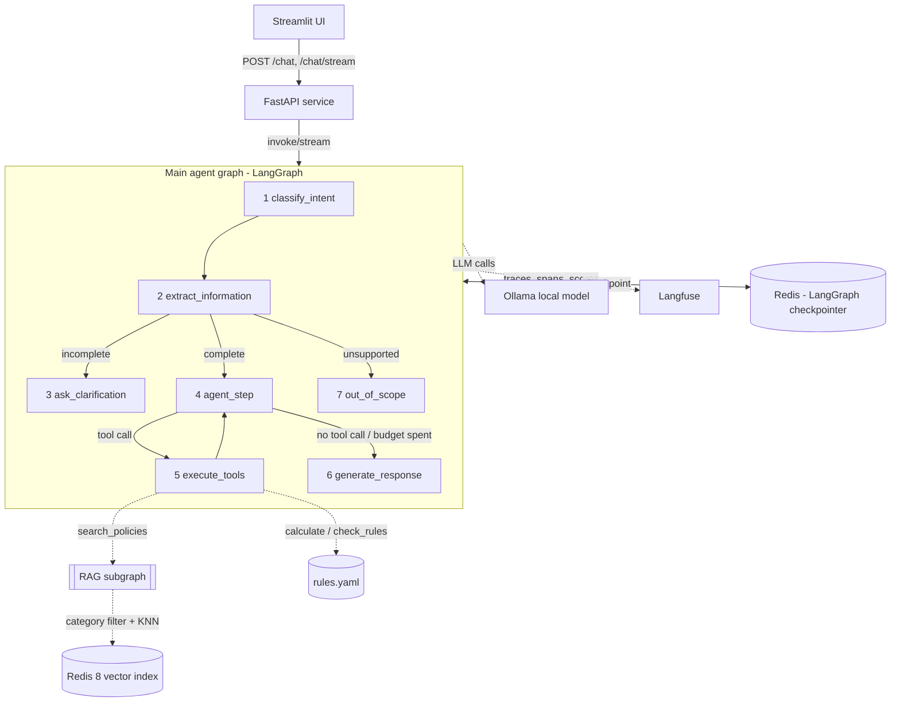

# RAG-assistant

Agentic RAG prototype: a corporate expense reimbursement and employee benefits assistant, built with
LangChain + LangGraph, a local open-source LLM (Ollama), Redis 8, FastAPI and Streamlit.

> **This assistant describes a fictional company.** Every policy, limit, rate and rule it cites is
> made up for this prototype. Nothing it says is real company policy, and nothing it says is tax or
> legal advice.

## 1. The problem and why this topic

An agentic RAG chatbot that answers employees' questions about expense reimbursement and benefits
against a fictional company's internal policies: whether an expense is reimbursable, how much can be
claimed, which supporting documents are required, whether manager approval is needed, and what the
next step is.

The topic was chosen deliberately close to a consulting/audit environment's own subject matter
(financial processes, internal controls, governance) while also being a genuinely good fit for the
assignment's technical requirements: it is document-based (needs RAG for "what does the policy say"),
decision-heavy (limits, eligibility, deadlines, approval thresholds) and calculation-heavy (needs
deterministic tools, not LLM arithmetic). See
[`.docs/plan/01-idea-plan.en.md`](.docs/plan/01-idea-plan.en.md) for the full problem statement and
[`.docs/plan/02-technical-design.en.md`](.docs/plan/02-technical-design.en.md) for the complete
implementation reference this README summarises.

**Why agentic RAG instead of plain RAG.** A typical question — *"I commute to work by car, I live 32
km from the office, and I come in three times a week. How much allowance can I get this month?"* —
cannot be answered by retrieving one passage. The system has to recognise the category, extract the
data, ask back when something is ambiguous (is 32 km one-way or round trip?), find the applicable
rule, check eligibility and calculate the amount. That needs intent recognition, state management,
conditional routing, autonomous tool use and clarification — agentic behaviour, not a single retrieval
step. The one non-negotiable behaviour: **when a question is incomplete, the assistant asks — it never
guesses.**

## 2. User journeys

- **Grounded policy question** — "What is the reimbursement limit for a business meal?" → retrieval,
  a cited answer, no calculation.
- **Complete reimbursement request** — category, amount and supporting facts all present in one
  message → the agent searches policy, calculates the amount, checks eligibility/caps/approval, and
  answers with a deterministic decision (`eligible` / `partially_eligible` / `not_eligible`) and
  citations.
- **Clarification and resume** — an ambiguous or incomplete claim (e.g. an unstated one-way/round-trip
  distance) gets a targeted follow-up question; the user's next message in the same thread resumes
  the same claim rather than starting over.
- **Deadline check** — "Is it still within the deadline to submit this expense?" evaluated against a
  pinned or current reference date.
- **Unsupported / out-of-scope** — tax/legal advice or unrelated requests get an explicit
  out-of-scope response with a disclaimer, never a fabricated policy answer.
- **Streamed steps and sources** — the Streamlit UI shows step-by-step progress (`Request understood`
  → `Information extracted` → `Policies searched` → `Rules checked` → `Answer prepared`) and the cited
  sources live, then collapses them under the answer once the turn completes.

## 3. Architecture



**LangChain owns**: documents and splitting (`DocxToMarkdownConverter`, `MarkdownChunker`),
embeddings (`E5Embeddings`), the Redis vector store and retriever, prompts (`ChatPromptTemplate`),
the chat model abstraction (`ChatOllama`/`FakeListChatModel`), messages, structured output
(`with_structured_output`) and tools (`@tool`, `bind_tools`, `ToolNode`).

**LangGraph owns**: state (`AgentState`, checkpointed per conversation thread), routing (conditional
edges), tool execution (`ToolNode`), checkpointing (`AsyncRedisSaver`) and streaming
(`astream(stream_mode=["updates", "messages"])`).

The agent runs entirely inside the FastAPI service; the Streamlit UI is a thin HTTP client with no
graph imports, so the agent stays independently callable (curl, the eval harness, the load-test
endpoint, another front-end).

**Two-layer knowledge design** — the single most important design decision in the project:

- **Prose policies** (`.docs/sources/en/*.docx`) are the RAG corpus: they answer "what does the rule
  say" and provide citations.
- **A machine-readable rule catalogue** (`rules.yaml`) drives the deterministic tools: limits, rates,
  thresholds, deadlines. The LLM never invents or copies a policy number into a tool call — the
  deterministic tool selects the applicable rule from the validated claim and catalogue, then
  computes. A consistency test keeps both in sync, so a citation always backs the number that was
  calculated.

`rules.yaml` is **hand-authored** in this PoC on purpose: with the numbers fixed, a wrong calculation
has exactly one possible cause (the tool), so the eval's calculation metric can't confuse bad
extraction with a bad tool. §4 of the technical design records what a production version would do
instead (§6 below).

### 3.1 Main agent graph (7 nodes)

1. `classify_intent` — structured-output intent + optional category classification.
2. `extract_information` — merges expense-claim fields extracted from the conversation.
3. `ask_clarification` — asks for exactly one missing required slot, deterministically (a slot table
   keyed by `(intent, category)`, not a prompt instruction) — ends the turn; the checkpointed claim
   resumes on the user's next message in the same thread.
4. `agent_step` — a ReAct tool-calling loop: the model decides, each iteration, whether to call a
   tool and which one (`search_policies`, `calculate`, `check_rules`) via `bind_tools()`. There is no
   static intent→tool table — tool selection is the one piece of the design that most directly
   demonstrates autonomous decision-making, bounded by deterministic guardrails (a 4-step budget,
   duplicate-call reuse, disable-after-two-argument-errors).
5. `execute_tools` — a generic LangGraph `ToolNode`.
6. `generate_response` — grounds the final answer in the gathered tool evidence and derives the
   deterministic `decision`.
7. `out_of_scope` — an explicit disclaimer for unsupported requests, never a fabricated answer.

### 3.2 RAG subgraph

Deliberately simple, and reusable outside the main graph: query embedding → similarity search with a
category-tag filter → context assembly with `[S1]`/`[S2]`-style citations, budgeted to a token limit.
The complexity of the project lives in the agentic workflow and the tools, not in the retriever.
Section headings are prepended to every chunk's `page_content` (not only metadata), so a chunk is
self-describing for both embedding and retrieval even split across multiple pieces.

### 3.3 Deterministic tools

- **`calculate`** — pure-function reimbursement math per category (meal per-person cap, travel
  subtype caps, mileage rate, commuting pass/ticket/vehicle formulas, equipment passthrough, benefits
  budget/ratio) with rounding, caps and excess reported explicitly.
- **`check_rules`** — eligibility, document/receipt requirements, approval-tier thresholds and the
  submission deadline, evaluated against the validated rule catalogue and a pinned or current
  reference date.

Both read the current claim through LangGraph's injected `ToolRuntime` rather than the model
re-stating it as a tool argument, and both return typed pydantic results (`CalculationResult`,
`list[Finding]`) as tool artifacts — never free text the model would have to parse back.

## 4. Redis: single datastore, and what that costs

Redis 8 holds both the policy vector index (`RediSearch`) and LangGraph's conversation checkpoints —
one mature, well-understood database rather than a specialised vector database plus a separate
key-value store. This reflects real production experience running Redis-backed systems: fewer moving
parts, one healthcheck, shared state if the UI is ever scaled horizontally. The cost, stated plainly:
Redis Search's in-memory index holds the whole corpus, and the LangChain Redis integration still
depends on Redis Search index/schema compatibility even though it encapsulates `FT.CREATE`, KNN query
construction and vector serialisation. For a corpus of a few hundred chunks this is a good trade; a
much larger corpus would be worth evaluating behind the same LangChain vector-store interfaces.
`langgraph-checkpoint-redis`'s `AsyncRedisSaver` is used rather than a hand-rolled checkpointer;
isolated graph unit tests use LangGraph's in-memory saver so they stay Redis-free.

## 5. Model trade-offs

| Model | Pros | Cons |
| --- | --- | --- |
| `qwen2.5:7b-instruct-q4_K_M` (chosen) | best structured-output/tool-calling reliability at this size; usable Hungarian capability | 4–5 GB RAM, slow on pure CPU |
| `llama3.1:8b-instruct` | strong reasoning on English | weaker Hungarian, larger, slower |
| `qwen2.5:3b-instruct` | 2–3× faster, fits small machines | more extraction errors |
| Dummy LangChain test chat model | deterministic CI/tests, no Ollama needed | canned answers only |

The 7B ceiling is a direct consequence of running everything (Ollama + Redis + the API) on one
developer machine, no paid API. The knowledge base is English-only with one Redis index — Hungarian
conversation is a **best-effort model capability** (the multilingual `intfloat/multilingual-e5-small`
embedder plus Qwen's own multilingual instruction-following), not a claim that the knowledge base
itself is localised; the official evaluation stays English. Temperature is `0` for classification,
extraction and tool selection.

## 6. Production rule-catalogue extraction (not built here)

`rules.yaml` is hand-authored for this PoC. A non-PoC version would generate the catalogue from
uploaded policy documents instead: detect and normalise their structure (real uploads rarely share
this PoC's clean, structured source pack), run an offline LLM pass proposing rules into the same
pydantic schema with the exact `doc_ref` each came from, accept a rule only if its number appears
verbatim in the cited section (the same consistency check this PoC already runs as a test, reused as
a gate), and require a human diff review before the catalogue is versioned. At runtime nothing
changes — the tools still read a validated catalogue, never raw LLM output. Left out here because an
extraction pipeline plus review workflow is a project of its own, and none of it changes the agentic
behaviour this assignment grades.

## 7. Setup, configuration and run commands

Requires [`uv`](https://docs.astral.sh/uv/) (installs Python 3.12 automatically) and Docker.

```bash
uv sync --dev
cp .env.example .env
```

`Settings` (`app/settings.py`) loads `.env` automatically; the committed `.env.example` documents
every setting and contains no credentials.

### Clean-start containerised runtime (recommended)

```bash
docker compose up
```

One image serves both processes (`api`, `ui` — same build, different command). This brings up Redis
8 (+ Redis Insight at <http://127.0.0.1:5540>), Ollama (pulling the configured model on first start),
the API (`entrypoint.sh` waits for dependencies, ingests the corpus if the manifest doesn't already
match, then serves) and the Streamlit UI. Once `api` reports healthy:

- Streamlit UI: <http://127.0.0.1:8501>
- API + Swagger docs: <http://127.0.0.1:8000/docs>
- `GET /health` — liveness; `GET /ready` — Redis reachable + index dimension match, LLM responding.

### Local development (dummy backend, no Ollama)

```bash
docker compose up -d redis redisinsight
LLM_BACKEND=dummy uv run uvicorn app.main:app --port 8000
# in a second terminal
API_BASE_URL=http://127.0.0.1:8000 uv run streamlit run app/ui.py
```

### Quality gate

```bash
uv run ruff check .
uv run ruff format --check .
uv run bandit -c pyproject.toml -r app
uv run pytest --cov=app --cov-report=term-missing --cov-report=xml
```

`make check` runs all four. The same checks run in
[`.github/workflows/ci.yml`](.github/workflows/ci.yml) in that order (lint → format → security →
test+coverage → SonarQube Cloud), with `SONAR_TOKEN`/`SONAR_ORGANIZATION`/`SONAR_PROJECT_KEY`
supplied only by CI secrets/variables — fork PRs run everything except the Sonar submission. Locally:

```bash
cp sonar-project.properties.example sonar-project.properties   # gitignored, fill in your own keys
export SONAR_TOKEN="<your-token>"
make sonar
```

### Functional evaluation and load test

```bash
# Requires LANGFUSE_ENABLED=true and real credentials in .env, and the API reachable at API_BASE_URL.
uv run python -m eval.run_eval               # full 20-case functional evaluation
uv run python -m eval.run_eval --node intent # classifier-only fast pass
curl -X POST http://127.0.0.1:8000/admin/load-test \
  -H 'Content-Type: application/json' \
  -d '{"dataset_name": "rag-assistant-functional", "repetitions": 3, "max_concurrency": 4}'
```

## 8. Evaluation method and results

**Dataset** — `eval/dataset.json`, 20 version-controlled cases spanning general policy, all six
expense categories (meal, travel, commuting, mileage, equipment, benefits), a one-way/round-trip
clarification, a still-open and an expired submission deadline, a missing-receipt case and an
out-of-scope question. Every case's `expected_amount_huf`/`expected_decision` was verified against
the real `ReimbursementCalculator`/`RuleChecker` output for its exact claim fields before being
committed, not hand-computed — so a case failing means the agent diverged from the deterministic rule
engine, not that the dataset is wrong.

**Metrics** (`eval/metrics.py`, six deterministic Langfuse evaluators, no answer-prose parsing
anywhere): classification accuracy (intent + category), slot accuracy (share of expected `ExpenseClaim`
fields matching exactly), retrieval hit@4, tool-selection accuracy (exact ordered tool-call list —
the strictest, most model-behavior-sensitive metric), outcome accuracy (decision + calculated amount),
citation accuracy (an expected document actually placed in the answer's citation context, not merely
retrieved).

**Runner** — `python -m eval.run_eval` idempotently syncs the dataset to a Langfuse dataset
(`rag-assistant-functional`, upserted by stable case id) and runs it as a Langfuse
`dataset.run_experiment(...)`, which supplies concurrency, per-item tracing/dataset-run linking and
per-metric score recording; the application supplies only the task function (one `POST /admin/eval`
per case, pinning `reference_date` for deterministic deadline math) and the metric functions. One
failing case never aborts the run. A local Markdown + JSON report lands under `.docs/eval/`.

**Results** (`qwen2.5:7b-instruct-q4_K_M`, official run 2026-08-02T10:26:25Z, 20 cases):

| Metric | Pass rate | Scored cases |
| --- | --- | --- |
| classification_accuracy | 90.0% | 20 |
| slot_accuracy | 11.8% | 17 |
| retrieval_hit_at_4 | 0.0% | 18 |
| tool_selection_accuracy | 15.0% | 20 |
| outcome_accuracy | 25.0% | 20 |
| citation_accuracy | 0.0% | 18 |

Langfuse experiment:
<https://cloud.langfuse.com/project/cms7txjr50008ad0jxqp7myo0/datasets/cmsbnbrox02a9ad0h25lj6w0b/runs/8ae3032e-758d-407b-8990-045ea29d1e19>.
Full per-case breakdown and failure notes: `.docs/eval/functional-20260802-102625.md`.

**Analysis — these numbers are real and honest, and the low scores have one consistent, verified
root cause.** `classification_accuracy` (intent + category) is strong at 90%; every metric downstream
of `extract_information` is weak. Spot-checking individual `/admin/eval` calls for low-scoring cases
shows the 7B model frequently fails to produce the *exact* canonical value the extraction prompt asks
for — e.g. writing `expense_type: "transport"` instead of the required `"pass"`, or failing to infer
an implied numeric zero from "no alcohol" into `non_reimbursable_amount: 0`. Because
`route_after_extraction` is deterministic and correct, an imprecise extraction correctly routes the
turn to `ask_clarification` *before* the agent ever reaches `agent_step`/`search_policies` — so
`retrieval_hit_at_4`, `tool_selection_accuracy` and `citation_accuracy` are structurally zero for any
turn that never reaches the tool-calling loop, which is most of them here. This is the evaluation
harness catching a genuine capability limit of a small, locally-served model under this design — not
a software defect, and not something the dataset was loosened to hide. One real dataset-authoring bug
*was* found and fixed this way: `general-01`'s expected documents were assigned from a category tag
without checking the actual corpus file titles, and pointed partly at a glossary document; verified
directly against the live endpoint and corrected (see the dated change-log entry). A materially better
score on the extraction-dependent metrics would need either a larger/more instruction-precise model
than fits the one-developer-machine budget (§5), or a refined extraction prompt with explicit
few-shot examples of the canonical enum values — both documented as follow-ups, not implemented here.

## 9. Load test method and results

`POST /admin/load-test` replays a named Langfuse dataset through the exact same `AgentService` module
`/chat` uses (never a recursive HTTP call to itself), under bounded concurrency supplied by the same
Langfuse experiment runner. Endpoint is intentionally synchronous — no job queue, no progress
polling, no cancellation; callers must allow a long request timeout. It measures the complete graph
invocation only, not `/chat` transport overhead or network latency.

**Results** (default 20-item dataset × 3 repetitions = 60 measured turns, `max_concurrency=4`, run
<!-- LOAD_TEST_TIMESTAMP -->):

<!-- LOAD_TEST_RESULTS_TABLE -->

Langfuse dataset runs: <!-- LOAD_TEST_LANGFUSE_URLS -->.

**Bottleneck**: a complete turn makes 2 fixed model calls (classify, extract) plus 1 final response
call plus 1–4 agent tool-selection calls — 4–7 LLM calls per turn depending on how many tools the
agent decides to use. Ollama serialises generation on this one local model, so aggregate LLM
generation dominates total latency by an order of magnitude; concurrency beyond ~2–4 is expected to
mostly grow queue time rather than throughput, confirmed by comparing per-repetition wall time against
the linked per-generation Langfuse spans <!-- BOTTLENECK_NOTE -->. Retrieval (a single CPU embedding
forward pass + Redis KNN over a few hundred vectors) and the deterministic tools are sub-millisecond
by comparison — exactly why the retrieval path was kept simple.

**Documented, not implemented, optimisations**:

1. **Fast path for simple policy questions** — when intent is `policy_question` with high confidence,
   skip `extract_information` and proceed directly to the agent loop, removing one LLM call without
   removing the dedicated classifier or autonomous tool choice.
2. **Production Redis cache layer** — cache query embeddings and retrieval results with bounded TTLs,
   once real traffic shows enough repeated questions to justify the invalidation/observability cost.

The PoC stays uncached deliberately, so its behaviour and latency remain easy to explain.

## 10. PoC boundaries (deliberately out of scope)

| Not in scope | Why, and what it would take |
| --- | --- |
| Authentication / authorisation | No user identity; "am *I* eligible" is answered from what the user types, not an HR record. The API host port is loopback-only, but that is a network-placement convenience, not access control. A production version should give Streamlit a service token and let an authorised Swagger user supply a separate token through Swagger's `Authorize` flow, plus SSO on the UI and tenure/budget read from HR. |
| Multi-tenancy | One fictional company, one policy set, one `rules.yaml`. Tenant-scoped indices and catalogue would be the shape. |
| Real financial/ERP integration | No booking, no submission, no ERP call — tells you what's claimable, doesn't file it. |
| Live FX rates | Fixed fictional rates in `rules.yaml`. A real system needs a rate provider plus a rate-date rule. |
| Receipt/OCR input | Amounts come from the conversation, not an uploaded invoice; `ExpenseClaim` is already the seam for a future extraction step. |
| Rule versioning / effective dates | One current catalogue; no "which rule applied last March". |
| Audit trail | Langfuse traces and 7-day operational logs are for debugging, not audit — no tamper resistance or per-user attribution. |
| Personal-data handling & content safety | Conversations sit in Redis with a 24h TTL, no encryption/redaction/export-delete flow. See §11 below. |
| Horizontal scale / rate limiting | One `uvicorn` process, one Ollama, no queue, no per-client limits — state is already in Redis so more API workers is a compose change; the LLM is the actual constraint. |
| Prompt-injection hardening | The corpus is trusted because we wrote it; retrieved context isn't treated as untrusted input. |
| Localised (non-English) policy corpora | One English corpus; Hungarian conversation is a model capability, not a second indexed language. |

None of these change the graph, the tools or the retrieval path — each is an integration or
operational concern layered around the same seams (`ExpenseClaim` as the tools' single input
contract, `rules.yaml` as the single source of numbers, the API as the single entry point).

## 11. Production recommendations (not implemented)

**Personal data and content safety.** A production system should add a PII detection and redaction
layer before prompts, persistence and observability, with controlled re-identification only where the
business flow requires it: Microsoft Presidio for a self-hosted deployment, or Azure-native PII
detection together with Azure AI Content Safety (or the model endpoint's own content filters) on
Azure. The same policy should inspect uploaded documents, user input and generated output, recording
blocked/redacted events in an audit trail without storing the sensitive value itself.

**GDPR** requires a dedicated production assessment and controls; this submission does not claim
legal compliance.

**EU AI Act** — indicative engineering-level gaps, not a legal determination:

- no documented AI-literacy/role-specific training for people operating or supervising the system;
- no compliance control informing employees they are interacting with an AI system;
- no formal assessment of whether production use stays an informational assistant or materially
  influences employment/benefits decisions (which could bring employment-related high-risk
  classification into scope);
- if high-risk: no complete risk-management system, data-governance process, technical
  documentation, compliant event logging, human-oversight procedure, accuracy/robustness/cybersecurity
  evidence, post-market monitoring or serious-incident process;
- no process for notifying affected employees/workers' representatives before deployment;
- no assessed mechanism for machine-readable identification of AI-generated output where required.

The organisation's role (provider, deployer or both), intended use and actual influence on employment
decisions must be assessed by qualified legal and compliance specialists before any production use —
this project makes no compliance claim.

## 12. Key design decisions (full rationale in [§17](.docs/plan/02-technical-design.en.md))

- **Tool selection is a ReAct loop**, not a static intent→tool table or a single planner call — the
  one piece of the design that most directly demonstrates autonomous decision-making, bounded by
  deterministic guardrails (step budget, duplicate-call reuse, argument-retry-then-disable).
- **Langfuse is required**, not an optional bonus layer, for the official eval and load runs — the
  per-case scores, prompt-version linkage and per-generation bottleneck spans are exactly the evidence
  the assignment asks for.
- **SSE streaming** is kept alongside plain `/chat` because watching steps and sources appear live is
  a materially better demonstration of agentic behaviour than a blocking response.
- **SonarCloud + Bandit + Ruff + CI** are kept even though the brief only grades code by inspection,
  for an objective, citable quality signal and automatic regression detection.
- **Prompt resolution stays dual-path** (Langfuse-hosted with an embedded fallback) under the same
  `LANGFUSE_ENABLED` switch that already governs tracing, rather than two separate toggles.
- **Redis as the single datastore** — see §4 above.

## 13. Requirement traceability

| Assignment requirement | Where it is satisfied |
| --- | --- |
| Real problem + justification | §1 above, [`01-idea-plan.en.md`](.docs/plan/01-idea-plan.en.md) |
| LangChain/LangGraph implementation | §3 above; technical design §4–§9 |
| LangGraph agentic workflow, ≥5 nodes | §3.1 above — 7 nodes |
| Autonomous decision making (conditional routing) | §3.1 above — ReAct tool-calling loop; `route_after_agent` |
| Decomposition into subtasks | §3.1 above — classification, extraction, routing, tool execution, response generation as separate nodes |
| State management for intermediate results | `AgentState`, checkpointed per thread (Redis) |
| ≥2 tools, at least one non-retrieval | §3.3 above — `calculate`, `check_rules` |
| Dedicated modular RAG subgraph | §3.2 above |
| Free-form text data source, quality over quantity | Fictional `.docx` policy corpus, header-aware chunking, one Redis vector index |
| No paid API, local open-source LLM + trade-off notes | §5 above |
| Streamlit UI showing the main steps and RAG result | §2 above — streamed step/source summary |
| Containerised, Dockerfile mandatory, compose preferred | §7 above — root `Dockerfile` + compose with `api`, `ui`, `ollama`, `redis` |
| 10–20 question functional eval | §8 above |
| 50–200 query load test, latency, bottleneck, 1–2 optimisations | §9 above |
| README with problem, architecture, results, run instructions | this file |

## 14. What's committed, what isn't

No credentials, personal data, embedding/model caches, runtime logs or machine-specific artifacts are
committed — `.env`, `.venv`, `logs/`, `.sonar/`, `sonar-project.properties` and coverage/cache
directories are all gitignored (see [`.gitignore`](.gitignore)); `.env.example` and
`sonar-project.properties.example` are the committed templates.
